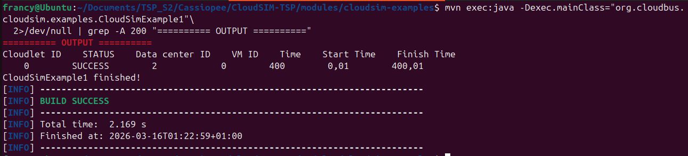
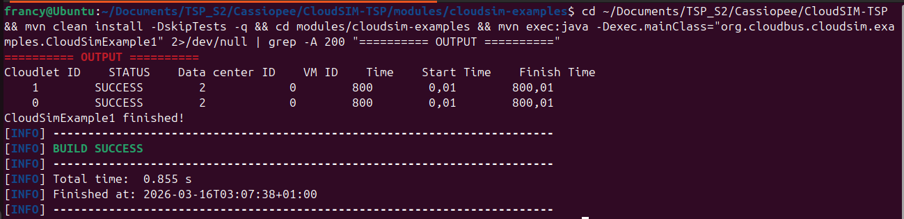
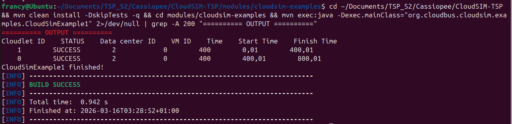
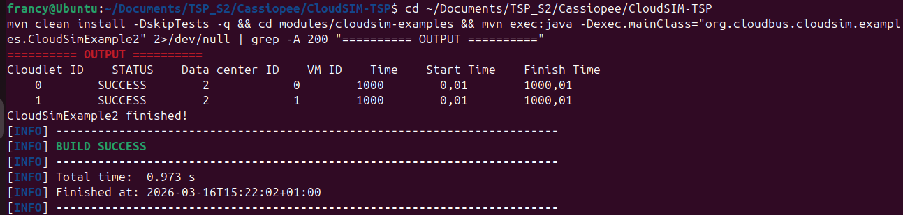
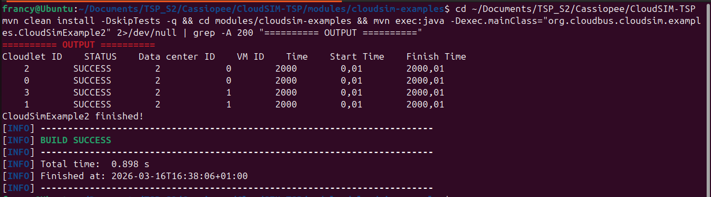
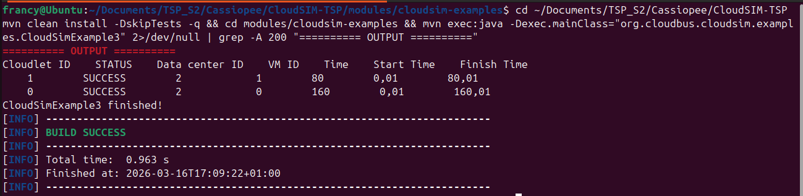
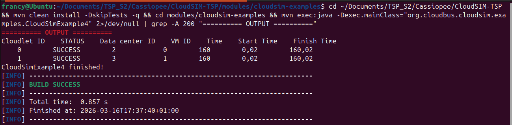
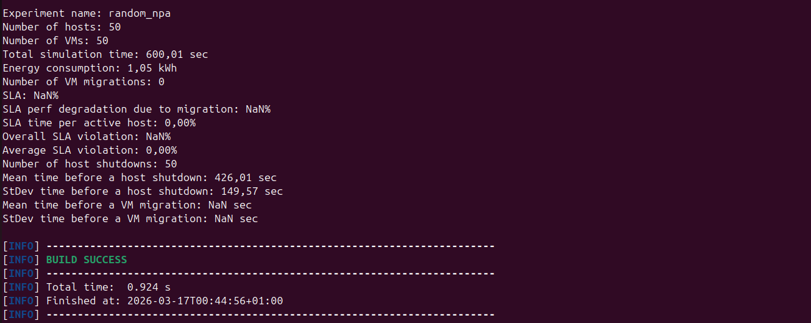

# ============== __SEMAINE 1__ =====================

#Installer Maven

```
sudo apt install maven -y
mvn -version
```

# Compiler des dossiers

```
mvn clean install
```

# Execution des exemples
Les cmd mvn se lance depuis le dossier **/CloudSIM-TSP/modules/cloudsim-examples**
Contenant fichier **pom.xml**

## Dans le dossier des exemples

```
cd ~/Documents/TSP_S2/Cassiopee/CloudSIM-TSP/modules/cloudsim-examples
```

## Exemple 1


```
mvn exec:java -Dexec.mainClass="org.cloudbus.cloudsim.examples.CloudSimExample1"
```

## les autres exemples
```
for i in 2 3 4 5 6 7 8 9; do
  echo
  echo "-      CloudSimExample$i      -"
  echo
  mvn exec:java -Dexec.mainClass="org.cloudbus.cloudsim.examples.CloudSimExample$i"\
  2>/dev/null | grep -A 200 "========== OUTPUT =========="
done
```

# COMPRENDRE L'OUTILS ET COMPOSANTS AVANT DE DEMARRER 

## 5 Concepts fondamentaux

### 1. Cloudlet (La tâche)
C'est __une tâche à exécuter__ (comme un programme, un calcul, un traitement de données)

Dans la vraie vie : C'est un job qu'un utilisateur soumet au cloud (ex: "traite ce fichier Excel", "rends cette vidéo")

#### Paramètres

Longueur (MI) = Million d'Instructions : plus c'est grand, plus la tâche est longue

### 2. VM
Un "ordinateur virtuel" qui exécute les tâches

#### Paramètres :__

__MIPS__ = Million d'Instructions Par Seconde : C'est la puissance de la VM

Plus le MIPS est élevé, plus la VM est rapide

### 3. Host (Serveur physique)
C'est quoi ? Le vrai serveur dans le datacenter

#### Paramètres :

__Nb de PE (Processing Element)__ = Nombre de Cœurs du Processeur (CPU)

Un host peut héberger plusieurs VMs

### 4. Datacenter
C'est Le bâtiment avec tous les serveurs

#### Paramètres :

Combien de hosts, comment allouer les ressources ?

### 5. Broker (Le courtier)
L'intermédiaire entre l'utilisateur et le cloud

Dans la vraie vie : La console AWS ou Azure qu'on utilise pour lancer des VMs

Rôle : Il dit "je veux ces VMs" puis "je veux exécuter ces tâches sur ces VMs"

## Tableau Récapitulatif


## Architecture Nominal


##  Métriques de performances

__Performance__          → Finish Time de chaque Cloudlet (temps d'exécution)
__Énergie Consommée__    → getEnergyConsumption() sur les hôtes (en Joules ou kWh)

### Finish Time
Il est extrait directement de l’objet Cloudlet à la fin de la simulation.

On peut accéder à ce résultat via :

```
cloudlet.getFinishTime();
```

### Calcul de la consommation d’énergie

Chaque Host possède un modèle énergétique (par exemple, PowerModel).
Ce modèle calcule la consommation en fonction de la charge CPU réelle pendant la simulation.

On obtient la consommation énergétique avec :

```
host.getEnergyConsumption();  // Joules ou kWh selon modèle
```

Cette valeur est une somme sur toute la durée de la simulation.


# ============= __SEMAINE 2__ ==============

## __OBJECTIF__ : Comprendre Comment une tâche est exécutée dans CloudSim, de A à Z.


## 1. datacenterBrocker

L'intermédiaire entre l'utilisateur et le datacenter. __Tu lui donnes des VMs et des Cloudlets, il gère tout le reste automatiquement.__

### Creation

```
DatacenterBroker broker = new DatacenterBroker("Broker_0");
```

### Methodes utiles 

```
//1. Soumettre les VMs au datacenter
broker.submitGuestList(vmList);

// 2. Soumettre les Cloudlets
broker.submitCloudletList(cloudletList);

// 3. Forcer une tâche sur une VM spécifique (optionnel)
broker.bindCloudletToVm(cloudletId, vmId);
```

__scenario__

## 4. Ce qui se passe automatiquement en interne

```
1. broker démarre

2. découvre les datacenters disponibles

3. crée les VMs sur le premier datacenter disponible

4. une fois les VMs créées → soumet les Cloudlets
      (par défaut : round-robin sur les VMs)

5. quand un Cloudlet finit → le récupère dans cloudletReceivedList

6. quand tout est fini → détruit les VMs → fin de simulation
```

__Important :__ Par défaut le broker distribue les Cloudlets en round-robin sur les VMs. Pour un contrôle précis on utilisera `bindCloudletToVm()`.


### Une Methode pour recuperer les résultats

```
// Récupérer tous les Cloudlets terminés avec leurs métriques

broker.getCloudletReceivedList()

// Exemple de boucle de collecte des résultats :

for (Cloudlet c : broker.getCloudletReceivedList()) {
    double temps = c.getExecFinishTime() - c.getExecStartTime();
    String statut = c.getStatus().toString();
}
```


## 2. Datacenter.java

Le bâtiment qui contient les serveurs. Il reçoit les événements et les distribue aux bons hôtes et VMs.

### Parametres


Le datacenter ne contient pas directement les hôtes. Il les contient via `DatacenterCharacteristics`. C'est un niveau d'indirection à retenir.

### Focus
`vmAllocationPolicy` : Décide de comment les VMs sont réparties sur les hôtes, ce qui impacte directement la __charge CPU__ et donc __l'énergie__.

### Remarque :

__Datacenter.java__  ne mesure pas l'énergie.
Pour le projet on utilisera sa classe fille : `PowerDatacenter.java` qui mesure l'énergie


## 3. Powerdatcenter.java

C'est __Datacenter.java + la mesure d'énergie__. C'est cette classe qu'on utiliseras dans tous les scénarios.

### Parametres

```
new PowerDatacenter(
    name,
    characteristics,
    vmAllocationPolicy,    // impact sur l'énergie
    storageList,
    schedulingInterval     // plus il est petit, plus la mesure est précise
)
```

### Metrique Energie 

```
powerDatacenter.getPower()  // énergie totale consommée en Watt·seconde
```

#### Autres :


## 4. host.java

Un serveur physique dans le datacenter. C'est lui qui héberge les VMs, et c'est __sa charge CPU qui détermine l'énergie consommée__.

### Parametres

```
new Host(
    id,
    ramProvisioner,   // gestion de la RAM  ex: new RamProvisionerSimple(ram)
    bwProvisioner,    // gestion bande passante ex: new BwProvisionerSimple(bw)
    storage,          // stockage en MB
    peList,           // liste des cœurs CPU ← impact direct sur performance
    vmScheduler       // comment les VMs se partagent les cœurs
)
```

#### Param. impactant Energie et Performance

__PE__ = Un cœur physique avec une capacité en MIPS

```
List<Pe> peList = new ArrayList<>();

peList.add(new Pe(0, new PeProvisionerSimple(1000))); // 1 cœur à 1000 MIPS

peList.add(new Pe(1, new PeProvisionerSimple(1000))); // 2e cœur
```

NB : Chaque ligne ajoute un (01) coeurs

__VmScheduler__ = Partage des cœurs entre VMs

```
new VmSchedulerTimeShared(peList) :  Les VMs partagent les cœurs et
                                     L'exécution se fait en simultané
                                     Chaque VM reçoit une fraction des MIPS
                                     (ex: 2 VMs sur 1000 MIPS → 500 MIPS chacune)

new VmSchedulerSpaceShared(peList) : Chaque VM obtient un cœur dédié exclusif
                                     - Si un cœur est disponible → VMs créées immédiatement
                                     - Si aucun cœur disponible  → VM en attente (même datacenter)
                                                                  → OU broker cherche ailleurs
```

### Methodes Utiles 

```
host.getTotalMips()              // capacité totale du serveur
host.getAvailableMips()          // MIPS encore disponibles
host.getNumberOfFreePes()        // cœurs libres
host.getGuestList()              // liste des VMs hébergées
```

#### Remarques : 

`Host.java` seul ne mesure pas l'énergie. Il faut sa classe fille : `PowerHost` contient le PowerModel (consommation physique du serveur).


## 5. PowerHost.java 

C'est __Host.java + un modèle de consommation électrique__. C'est la classe la plus importante pour mesurer l'énergie par serveur.

### Creation : un seul paramètre en plus par rapport à Host

```
new PowerHost(
    id,
    ramProvisioner,
    bwProvisioner,
    storage,
    peList,
    vmScheduler,
    powerModel         // ← LE paramètre clé : modèle de consommation électrique
)
```

#### Le PowerModel : pièce centrale pour l'énergie

C'est lui qui définit __combien de Watts consomme le serveur selon sa charge CPU__.

CloudSim fournit plusieurs modèles prêts à l'emploi dans power/models/ :


### Methodes utiles

```
// Consommation instantanée en Watts selon la charge actuelle
host.getPower()

// Consommation pour une charge donnée (entre 0 et 1)
host.getPower(0.75)  // consommation à 75% de charge CPU

// Historique de charge CPU ← utile pour tracer des courbes
host.getUtilizationHistory()

// Charge CPU actuelle (héritée de HostDynamicWorkload)
host.getUtilizationOfCpu()
```

### Quelques modeles de consommation...

Tous les modèls répondent à la même question :__"Si mon serveur est chargé à X%, combien de Watts consomme-t-il ?"__

#### Formule generale 

`Consommation = idle + (maxPower - idle) × f(utilisation)`

Ce qui change entre les modèles, c'est la fonction f() : la forme de la courbe.

#### Paremetres Communs

```
new PowerModelLinear(maxPower, staticPowerPercent)
// maxPower        = consommation à 100% de charge (ex: 200W)
// staticPowerPercent = % consommé à vide (ex: 0.5 = 50% → 100W idle)
```

#### Les 4 philosophies


## 6. Vm.java 

Une machine virtuelle qui tourne sur un hôte physique. Elle __reçoit les Cloudlets et les exécute selon une politique d'ordonnancement__.

### Création :

```
new Vm(
    id,                  // identifiant unique
    userId,              // id du broker propriétaire
    mips,                // puissance de calcul par cœur ← impact direct temps d'exécution
    numberOfPes,         // nb de cœurs ← impact charge CPU → énergie
    ram,                 // RAM en MB
    bw,                  // bande passante
    size,                // taille image disque en MB
    vmm,                 // "Xen" par convention
    cloudletScheduler    // ← politique d'ordonnancement des tâches
)
```

#### Focus 

```
mips,                // puissance de calcul par cœur ← impact direct temps d'exécution__

numberOfPes,         // nb de cœurs ← impact charge CPU → énergie__

cloudletScheduler    // ← politique d'ordonnancement des tâches__
```

__Temps d'exécution = cloudletLength / mips__

#### CloudletScheduler : paramètre crucial

C'est lui qui définit __comment la VM gère plusieurs Cloudlets en même temps__ :

```
new CloudletSchedulerTimeShared()
// Tous les Cloudlets s'exécutent en parallèle
// Chacun reçoit une fraction du MIPS → tous finissent plus tard
// Charge CPU élevée en permanence

new CloudletSchedulerSpaceShared()
// Les Cloudlets s'exécutent un par un
// Chacun reçoit 100% du MIPS → file d'attente possible
// Charge CPU plus variable
```

### Methodes utiles

```
1. Charge CPU de la VM à un instant donné (utilisée par PowerHost)

vm.getTotalUtilizationOfCpu(time)       // entre 0 et 1
vm.getTotalUtilizationOfCpuMips(time)   // en MIPS absolus

2. Ressources allouées réellement par l'hôte

vm.getCurrentAllocatedMips()            // MIPS effectivement alloués
vm.getCurrentAllocatedRam()             // RAM effectivement allouée

3. État de la VM

vm.isInMigration()                      // ← utile Phase 3 pour suivre les migrations
vm.getMips()                            // puissance configurée
vm.getNumberOfPes()                     // nb de cœurs
```

__c'est la VM qui remonte la charge CPU à l'hôte, qui calcule ensuite l'énergie via le PowerModel.__


## 7. Cloudlet.java

Un Cloudlet = une tâche applicative à exécuter dans le cloud. Dans la vraie vie c'est par exemple : un job de calcul, un traitement de données, une requête web.

__cloudletLength__ représente la quantité de travail d’une tâche en MI (Million Instructions).

1 MI = 1 000 000 instructions à exécuter (C’est la taille de la tâche que la machine virtuelle doit traiter).

__MIPS (Million Instructions Per Second)__

MIPS = puissance de calcul de la machine
(1 MIPS = 1 million d’instructions par seconde)

__Temps d'execution = ( MI / MIPS )__

__Charge Totale = cloudletLength × numberOfPes (MI)__


### UtilizationModel 
C'est ce qui définit comment la tâche consomme les ressources.

#### 3 Types :


### Paramètres (pour créer un Cloudlet)


### Métriques


#### Focus

```
cloudlet.getWallClockTime()  ---->  temps total (attente + exécution)
```


## POLITIQUES D'ORDONNANCEMENT 

### Niveau 1 - `VmScheduler` : partage des cœurs physiques entre VMs

__Question : comment un hôte physique partage ses cœurs entre plusieurs VMs ?__


### Niveau 2 - CloudletScheduler : partage des ressources VM entre Cloudlets

__Question : comment une VM partage ses ressources entre plusieurs Cloudlets ?__


__Makespan__ = temps entre le début du 1er Cloudlet et la fin du dernier :  c'est la métrique de performance globale.


### Remarques :

__Processor Sharing__ = C'est une variante de `TimeShared` mais plus fine.

`TimeShared classique` :
Divise le MIPS également entre tous les Cloudlets

`Processor Sharing` :
- Divise proportionnellement selon la demande de chaque Cloudlet
- Plus équitable, plus proche du comportement réel des OS

__Dans CloudSim c'est CloudletSchedulerDynamicWorkload__


# ============= __SEMAINE 3__ ==============

## CloudSimExample1.java

Ceci est un exemple simple de simulation avec CloudSim pour modéliser l’exécution de tâches dans un cloud.

Ce fichier : 

- Initialise l’environnement de simulation et crée un Datacenter et un DatacenterBroker.

- Configure une machine virtuelle (VM) et deux cloudlets (tâches à exécuter).

- Lance la simulation puis affiche les résultats : VM utilisée, temps d’exécution, début et fin des tâches.


__1. Initialisation de Cloudsim__

```
int num_user = 1;                                 // 1 seul utilisateur/broker
boolean trace_flag = false;                       // pas de log détaillé
CloudSim.init(num_user, calendar, trace_flag);
```

__2. Creation du datacenter__

```
Datacenter datacenter0 = createDatacenter("Datacenter_0");
```

Dans `createDatacenter()` :
```
// 1 seul cœur physique à 1000 MIPS
peList.add(new Pe(new PeProvisionerSimple(1000)));

// 1 seul hôte
new Host(
    new RamProvisionerSimple(2048),     // 2 GB RAM
    new BwProvisionerSimple(10000),     // 10 Gbps
    1000000,                            // 1 TB stockage
    peList,
    new VmSchedulerTimeShared(peList)   // partage TimeShared
)

// Datacenter basique : Pas de mesure énergie ici (Car Non Using de PowerDatacenter)
new Datacenter(name, characteristics,
    new VmAllocationPolicySimple(hostList), ...)
```

__3. Creation du Broker__ : 
```
broker = new DatacenterBroker("Broker");
```

__4. Création de la VM__

```
int mips = 1000;                  // puissance de calcul
int pesNumber = 1;                // 1 seul cœur
int ram = 512;                    // 512 MB RAM
long bw = 1000;                   // bande passante
new CloudletSchedulerTimeShared() // ordonnancement TimeShared
```

__5. Création du Cloudlet__

```
long length = 400000;      // 400 000 MI
int pesNumber = 1;         // 1 cœur
new UtilizationModelFull() // utilise 100% des ressources
```

### Tests 

`Remarques:` Recompiler après chaque modif. comme ci-dessous :

#### Commande :

```
cd ~/Documents/TSP_S2/Cassiopee/CloudSIM-TSP
mvn clean install -DskipTests -q && cd modules/cloudsim-examples && mvn exec:java -Dexec.mainClass="org.cloudbus.cloudsim.examples.CloudSimExample1" 2>/dev/null | grep -A 200 "========== OUTPUT =========="
```


### Test_0 : Execution de l'example 1



###  Variations des Paramètres

- Test_1 : Variation de la Puissance du VM.mips= 2000, 500, 100
- Test_2 : Varaiation de la taille du Cloudlet

#### Leçons :

```
1. MIPS VM ≤ MIPS HÔTE   ( Sinon, Aucun Cloudlet sera crée)

2. REGLE : Temps = cloudletLength ÷ mips

3. Le Temps d'exécution varie en fonction de ces paramètres ci-dessous :

- Cloudlet :
    - Taille
    - Nombre

- VM et Serveur : MIPS
```

#### Test_3 : Cloudlets Identiques + TimeShared( new CloudletSchedulerTimeShared() )

__Paramètres__ = 2 Cloudlets de 400 000 MI sur 1 VM à 1000 MIPS.
 
```
"TimeShared" --> Partage égal des mips entre Cloudlets : 1000 ÷ 2 = 500 MIPS
                 Et les deux s'executent en parallèle
```

##### Sortie :




#### Test_4 : 2 Cloudlets Identiques + SpaceShared ( CloudletSchedulerSpaceShared() )

```
Le 1er Commence fini, et l'autre debute ....Ainsi de suite.
```

##### Sortie :




##### Remarques :

- SpaceShared est plus efficace en __temps moyen__ (600 vs 800 sec) mais crée de l'attente pour certaines tâches.

- TimeShared est plus équitable : tout le monde finit en même temps mais plus tard.


## CloudSimExample2.java

Exemple de simulation avec __2 VMs__ et __2 Cloudlets__ sur __un seul hôte__ (serveur), __chaque tâche__ (cloudlets) étant explicitement __liée à une VM dédiée__.

Ce fichier :

- Initialise l'environnement de simulation et crée un seul Datacenter avec un hôte à 1000 MIPS et un DatacenterBroker.

- Configure 2 VMs identiques à 250 MIPS chacune avec un ordonnancement TimeShared.
```
Vm vm1 = new Vm(brokerId, mips, pesNumber, ram, bw, size, vmm, new CloudletSchedulerTimeShared());
Vm vm2 = new Vm(brokerId, mips, pesNumber, ram, bw, size, vmm, new CloudletSchedulerTimeShared());
```

- Crée 2 Cloudlets identiques de 250 000 MI et les lie explicitement chacun à une VM via bindCloudletToVm().

```
broker.bindCloudletToVm(cloudlet1.getId(), vm1.getId());
```

- Lance la simulation puis affiche les résultats :`Time`, `Start Time`, `Finish Time`, ...


### Tests

### Test_0 : Execution

```
cd ~/Documents/TSP_S2/Cassiopee/CloudSIM-TSP
mvn clean install -DskipTests -q && cd modules/cloudsim-examples && mvn exec:java -Dexec.mainClass="org.cloudbus.cloudsim.examples.CloudSimExample2" 2>/dev/null | grep -A 200 "========== OUTPUT =========="
```



### Remarques :

Aucune variation importante des paramètres n’a été réalisée dans cet exemple car les conclusions resteraient identiques à celles de l’Example1 concernant la relation entre la taille du Cloudlet et la puissance MIPS.

Cependant l’objectif principal de cet exemple est plutôt de montrer __l’exécution parallèle de tâches sur plusieurs machines virtuelles__ ainsi que __l’association explicite entre Cloudlets et VMs via le broker__, d'ou les deux (2) tests ci-dessous :


### Test_1 : Suppression du Binding + Ajout de 2 autres cloudlets (tâches)

__On commente le binding :__
```
//broker.bindCloudletToVm(cloudlet1.getCloudletId(),vm1.getId());
//broker.bindCloudletToVm(cloudlet2.getCloudletId(),vm2.getId());
```
__Création des Cloudets et Integration dans la liste :__
```
Cloudlet cloudlet3 = new Cloudlet(length, pesNumber, fileSize, outputSize,
                               utilizationModel, utilizationModel, utilizationModel);
cloudlet3.setUserId(brokerId);

Cloudlet cloudlet4 = new Cloudlet(length, pesNumber, fileSize, outputSize,
                               utilizationModel, utilizationModel, utilizationModel);
cloudlet4.setUserId(brokerId);


cloudletList.add(cloudlet3);
cloudletList.add(cloudlet4);
```

#### Sortie 




#### Interprétation :

Dans cette expérience, le nombre de cloudlets a été augmenté à quatre alors que seulement deux machines virtuelles sont disponibles.

Le `broker` distribue les tâches entre les VMs selon une politique simple de `type round-robin` (par défaut, car "binding" commenté). Chaque VM reçoit donc deux cloudlets.

Et comme l’ordonnanceur utilisé est `CloudletSchedulerTimeShared`, les tâches exécutées sur une même VM partagent la puissance CPU.
__La capacité de calcul__ de la VM (250 MIPS) est donc __divisée entre les deux cloudlets__, ce qui entraîne une diminution de la puissance disponible pour chaque tâche et double le temps d’exécution, passant de 1000 s à environ 2000 s.


## CloudSimExample3.java

Exemple de simulation avec __deux (02) VMs de puissances différentes sur un datacenter à 2 hôtes__, pour observer l'impact du MIPS sur le temps d'exécution.

Ce fichier : 
- Crée un Datacenter avec 2 hôtes identiques à 1000 MIPS chacun.
    ```
    hostList.add(new Host(...peList...));   // Hôte 1 : 1000 MIPS
    hostList.add(new Host(...peList2...));  // Hôte 2 : 1000 MIPS
    ```
- Configure 2 VMs de puissances différentes :
    - VM1 : 250 MIPS
    - VM2 : 500 MIPS (le double)
    ```
    Vm vm1 = new Vm(brokerId, mips, ...);        // mips = 250 MIPS

    Vm vm2 = new Vm(brokerId, mips * 2, ...);    // mips * 2 = 500 MIPS
    ```

- Crée 2 Cloudlets identiques de 40 000 MI liés chacun à une VM.
- Pas de mesure d'énergie — uniquement les temps d'exécution.


### Test_0 : Execution

```
cd ~/Documents/TSP_S2/Cassiopee/CloudSIM-TSP
mvn clean install -DskipTests -q && cd modules/cloudsim-examples && mvn exec:java -Dexec.mainClass="org.cloudbus.cloudsim.examples.CloudSimExample3" 2>/dev/null | grep -A 200 "========== OUTPUT =========="
```

#### Sortie :



#### Interpretation :

VM2 est 2 fois plus puissante que VM1 et donc finit 2 fois plus vite :
```
40 000 ÷ 500 = 80 sec  
40 000 ÷ 250 = 160 sec 
```

#### Remarques :

Pour cet exemple, les variations utiles seraient juste de rejouer ce qu'on a déjà fait sur l'exemple1 (changer MIPS, length...) : __on ne découvrirait rien de nouveau__.

Ce qu'Example3 apportait de nouveau c'était :
- 2 hôtes dans le datacenter
- 2 VMs de puissances différentes

Ces deux points sont compris et confirmés par les résultats ci-dessus.


## CloudSimExample4.java

Exemple de simulation avec 2 datacenters distincts, chacun avec un hôte en `SpaceShared`, pour observer la répartition des VMs sur plusieurs datacenters.

Ce fichier : 

- Crée 2 Datacenters distincts (Datacenter_0 et Datacenter_1) chacun avec 1 hôte à 1000 MIPS.

Ici, les hôtes utilisent `VmSchedulerSpaceShared` au lieu de TimeShared. Donc chaque VM obtient un cœur dédié.

- Configure 2 VMs identiques à 250 MIPS avec `CloudletSchedulerTimeShared`.
- Crée 2 Cloudlets identiques de 40 000 MI liés chacun à une VM.
- Le broker est créé via une méthode dédiée createBroker()

#### Sortie :




## Exemples : 5, 6, 7, 8 et 9.


```
Ces tests n’ont pas été exécutés, car ils sont indirectement couverts à travers les variations de paramètres et de politiques d’ordonnancement présentées dans les exemples précédents (notamment l’Exemple 9, qui compare TimeShared et SpaceShared). Leur exécution n’aurait donc apporté aucun élément d’analyse supplémentaire.

Cette remarque vaut pour certains cas ; toutefois, pour d’autres (notamment l’Exemple 8, qui décrit un GlobalBroker personnalisé créant un nouveau broker à t = 200 pendant la simulation), leur utilité immédiate n’apparaissait pas clairement.
```


## Autres Exemples : Mesure de l'energie 

### Structure des exemples dans le dossier power/

`planetlab/`  : Charges réelles issues de traces PlanetLab (réseau mondial de serveurs)

- __Caractéristiques :__

    - traces CPU collectées sur des serveurs réels

    - simulation réaliste

    - durée typique : 24 heures

    - utilisées dans les articles scientifiques

- __But :__

Tester les algorithmes d’optimisation énergétique dans un environnement proche du réel.


`__random/__` : Charges aléatoires synthétiques (Utilisation du CPU generé aléatoirement)

- __Caractéristiques :__

    - utilisation CPU générée par un modèle aléatoire

    - plus rapide à simuler

    - utile pour tests et comparaison rapide

- __But :__

    - valider le comportement d’un algorithme sans dépendre de traces externes


__Les fichiers communs aux deux sont__ :


`1. NonPowerAware` : Simulation sans gestion d'énergie

- __Caractéristiques :__

    - aucune consolidation de VM
    - aucune migration
    - aucun arrêt de serveur

Tous les hôtes restent actifs.


- __But :__

```
Servir de baseline (référence).
```

Ensuite on compare :

```
Energy avec optimisation
         VS
Energy sans optimisation
```


`2. Dvfs` : Dynamic Voltage Frequency Scaling


Les noms de fichiers suivent un pattern :


### Structure des noms de fichiers

`[Algorithme][Politique de migration]`


### Algorithmes de détection de surcharge : 

```
  Iqr  = InterQuartile Range
  Lr   = Local Regression
  Lrr  = Local Robust Regression
  Mad  = Median Absolute Deviation
  Thr  = Static Threshold

Quand surcharge détectée --> Migration de VM
```


#### 1. Iqr — InterQuartile Range

##### Principe : Analyse statistique de l'utilisation CPU

Si utilisation CPU dépasse :

```
Q3 + k × IQR     avec : IQR = Q3 - Q1

alors :

host considéré comme surchargé
```

##### Avantage : adaptatif aux variations de charge


#### 2. Lr — Local Regression

##### Principe : régression linéaire sur l'historique CPU

```
Il prédit l'utilisation CPU future.

Si surcharge prévue ---> migration anticipée
```


#### 3. Lrr — Local Robust Regression

Version robuste de LR.

__Différence :__ Moins sensible aux valeurs extrêmes (outliers)

(A Utiliser quand la charge CPU instable)


#### 4.Mad — Median Absolute Deviation

Il Mesure la __dispersion autour de la médiane__.

```
Si utilisation CPU dépasse :

median + k × MAD

alors :

host surchargé
```


#### 5. Thr — Static Threshold

C'est une Méthode simple.

Exemple :

```
CPU > 80%

alors :

host surchargé
```

__Inconvénient :__  non adaptatif


### Politiques de migration :

__Quand un host est surchargé, quelle VM migrer ?__

```
  Mc   = Minimum Correlation
  Mmt  = Minimum Migration Time
  Mu   = Minimum Utilization
  Rs   = Random Selection
```

#### 1. Mc : Minimum Correlation

__Principe :__

```
- On Mesure la corrélation CPU entre VMs...

- Migration de la VM la moins corrélée avec les autres
```

- __But :__ réduire risque de surcharge future


### 2. Mmt : Minimum Migration Time

```
On Choisit la VM la plus rapide à migrer
```


### 3. Mu : Minimum Utilization

```
On Choisit la VM avec la plus faible utilisation CPU
```

__Idée :__ Migrer une petite charge, plutôt qu’une grosse


### 4. Rs : Random Selection

```
Sélection d'une VM choisie aléatoirement.
```


### Exemple 1 : NonPowerAware.java

__NonPowereAware__  implique que Le système gère les machines virtuelles, CPU, mémoire, etc...Sans chercher à optimiser la consommation électrique.

#### Description et analyse

Simulation d'un datacenter qui consomme toujours à puissance maximale (Pas de gestion d'énergie). C'est la référence de base pour comparer avec les autres politiques.


__Voici ce qui change par rapport aux exemples précédents :__

__1. PowerDatacenterNonPowerAware__

```
PowerDatacenterNonPowerAware datacenter = Helper.createDatacenter("Datacenter",
                                                    PowerDatacenterNonPowerAware.class, ...)
```

Tous les hôtes consomment 100% de leur puissance en permanence, même à vide.__

__2. Paramètres externalisés dans des classes dédiées__

```
RandomConstants.NUMBER_OF_VMS         // nb de VMs → dans RandomConstants.java

RandomConstants.NUMBER_OF_HOSTS       // nb d'hôtes

Constants.SIMULATION_LIMIT            // durée de simulation → dans Constants.java

Constants.ENABLE_OUTPUT               // activer/désactiver les logs
```

__NB__ : Ici, On ne modifiera plus le code directement, seules les constantes le seront.


__3. Limite de simulation :__

```
CloudSim.terminateSimulation(Constants.SIMULATION_LIMIT);
```

La simulation s'arrête à un temps fixé et pas quand tous les Cloudlets sont finis.


__4. La Sortie est plus enrichie__

```
javaHelper.printResults(datacenter, vmList, lastClock, ...)
```

Affiche énergie consommée + métriques de performance : c'est la nouveauté principale !


#### Scenario : 

```
- 50 hôtes physiques (mix HP G4 et G5)
- 50 VMs (mix des 4 types EC2)
- Charges CPU aléatoires mais reproductibles
- Simulation sur 24 heures

On mesure donc l'énergie totale consommée sur 24h
```

#### Commande :

```
cd ~/Documents/TSP_S2/Cassiopee/CloudSIM-TSP && mvn clean install -DskipTests -q && cd modules/cloudsim-examples && mvn exec:java -Dexec.mainClass="org.cloudbus.cloudsim.examples.power.random.NonPowerAware" 2>/dev/null
```

Avec Filtre (Pour ne voir que l'essentiel) :

```
cd ~/Documents/TSP_S2/Cassiopee/CloudSIM-TSP && mvn clean install -DskipTests -q && cd modules/cloudsim-examples && mvn exec:java -Dexec.mainClass="org.cloudbus.cloudsim.examples.power.random.NonPowerAware" 2>/dev/null | grep -E "Energy|migration|SLA|hosts|VMs|Experiment|simulation time"
```

#### Sortie :



#### Interprétation :

La sortie se divise en 3 parties : 

- Partie 1 : les logs détaillés (les Très longues lignes)

- Partie 2 : Le résumé final

```
Experiment name: random_npa        
Number of hosts: 50                
Number of VMs: 50                  
Total simulation time: 600,01 sec     --> Durée simulée
Energy consumption: 1,05 kWh          --> Energie Consommée
Number of VM migrations: 0            --> nb de migrations effectuées
Number of host shutdowns: 50          --> nb de serveurs éteints
```

- Partie 3 : Les métriques SLA

```
SLA: NaN%                          
SLA perf degradation: NaN%         
SLA time per active host: 0,00%    -->  % du temps où SLA est violé
Overall SLA violation: NaN%        --> violation globale
Average SLA violation: 0,00%       --> violation moyenne
```


__SLA__ (Service Level Agreement) = Engagement de performance envers l'utilisateur. 

__NaN__ (Not a Number) : Pas calculable car les Cloudlets n'ont pas de SLA défini ici.