# ============== __SEMAINE 1__ =====================

#Installer Maven

```
sudo apt install maven -y
mvn -version
```

# Compiler des dossiers

```
mvn clean install
```

# Execution des exemples
Les cmd mvn se lance depuis le dossier **/CloudSIM-TSP/modules/cloudsim-examples**
Contenant fichier **pom.xml**

## Dans le dossier des exemples

```
cd ~/Documents/TSP_S2/Cassiopee/CloudSIM-TSP/modules/cloudsim-examples
```

## Exemple 1


```
mvn exec:java -Dexec.mainClass="org.cloudbus.cloudsim.examples.CloudSimExample1"
```

## les autres exemples
```
for i in 2 3 4 5 6 7 8 9; do
  echo
  echo "-      CloudSimExample$i      -"
  echo
  mvn exec:java -Dexec.mainClass="org.cloudbus.cloudsim.examples.CloudSimExample$i"\
  2>/dev/null | grep -A 200 "========== OUTPUT =========="
done
```

# COMPRENDRE L'OUTILS ET COMPOSANTS AVANT DE DEMARRER 

## 5 Concepts fondamentaux

### 1. Cloudlet (La tâche)
C'est __une tâche à exécuter__ (comme un programme, un calcul, un traitement de données)

Dans la vraie vie : C'est un job qu'un utilisateur soumet au cloud (ex: "traite ce fichier Excel", "rends cette vidéo")

#### Paramètres

Longueur (MI) = Million d'Instructions : plus c'est grand, plus la tâche est longue

### 2. VM
Un "ordinateur virtuel" qui exécute les tâches

#### Paramètres :__

__MIPS__ = Million d'Instructions Par Seconde : C'est la puissance de la VM

Plus le MIPS est élevé, plus la VM est rapide

### 3. Host (Serveur physique)
C'est quoi ? Le vrai serveur dans le datacenter

#### Paramètres :

__Nb de PE (Processing Element)__ = Nombre de Cœurs du Processeur (CPU)

Un host peut héberger plusieurs VMs

### 4. Datacenter
C'est Le bâtiment avec tous les serveurs

#### Paramètres :

Combien de hosts, comment allouer les ressources ?

### 5. Broker (Le courtier)
L'intermédiaire entre l'utilisateur et le cloud

Dans la vraie vie : La console AWS ou Azure qu'on utilise pour lancer des VMs

Rôle : Il dit "je veux ces VMs" puis "je veux exécuter ces tâches sur ces VMs"

## Tableau Récapitulatif
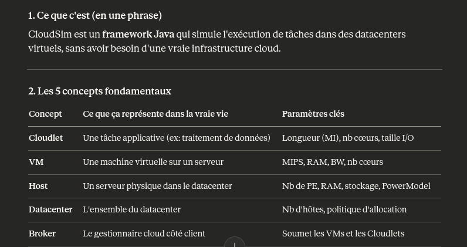

## Architecture Nominal
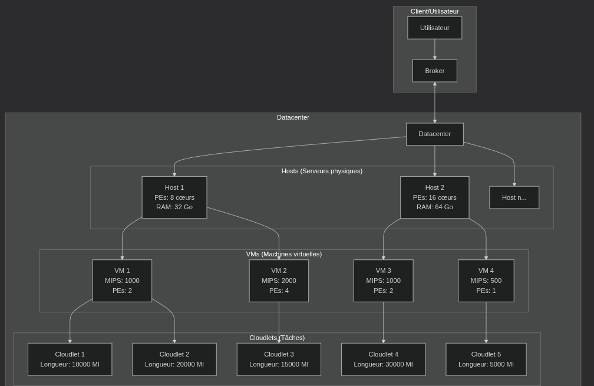


##  Métriques de performances

__Performance__          → Finish Time de chaque Cloudlet (temps d'exécution)
__Énergie Consommée__    → getEnergyConsumption() sur les hôtes (en Joules ou kWh)

### Finish Time
Il est extrait directement de l’objet Cloudlet à la fin de la simulation.

On peut accéder à ce résultat via :

```
cloudlet.getFinishTime();
```

### Calcul de la consommation d’énergie

Chaque Host possède un modèle énergétique (par exemple, PowerModel).
Ce modèle calcule la consommation en fonction de la charge CPU réelle pendant la simulation.

On obtient la consommation énergétique avec :

```
host.getEnergyConsumption();  // Joules ou kWh selon modèle
```

Cette valeur est une somme sur toute la durée de la simulation.


# ============= __SEMAINE 2__ ==============

## __OBJECTIF__ : Comprendre Comment une tâche est exécutée dans CloudSim, de A à Z.


## 1. datacenterBrocker

L'intermédiaire entre l'utilisateur et le datacenter. __Tu lui donnes des VMs et des Cloudlets, il gère tout le reste automatiquement.__

### Creation

```
DatacenterBroker broker = new DatacenterBroker("Broker_0");
```

### Methodes utiles 

```
//1. Soumettre les VMs au datacenter
broker.submitGuestList(vmList);

// 2. Soumettre les Cloudlets
broker.submitCloudletList(cloudletList);

// 3. Forcer une tâche sur une VM spécifique (optionnel)
broker.bindCloudletToVm(cloudletId, vmId);
```

__scenario__

## 4. Ce qui se passe automatiquement en interne

```
1. broker démarre

2. découvre les datacenters disponibles

3. crée les VMs sur le premier datacenter disponible

4. une fois les VMs créées → soumet les Cloudlets
      (par défaut : round-robin sur les VMs)

5. quand un Cloudlet finit → le récupère dans cloudletReceivedList

6. quand tout est fini → détruit les VMs → fin de simulation
```

__Important :__ Par défaut le broker distribue les Cloudlets en round-robin sur les VMs. Pour un contrôle précis on utilisera `bindCloudletToVm()`.


### Une Methode pour recuperer les résultats

```
// Récupérer tous les Cloudlets terminés avec leurs métriques

broker.getCloudletReceivedList()

// Exemple de boucle de collecte des résultats :

for (Cloudlet c : broker.getCloudletReceivedList()) {
    double temps = c.getExecFinishTime() - c.getExecStartTime();
    String statut = c.getStatus().toString();
}
```


## 2. Datacenter.java

Le bâtiment qui contient les serveurs. Il reçoit les événements et les distribue aux bons hôtes et VMs.

### Parametres
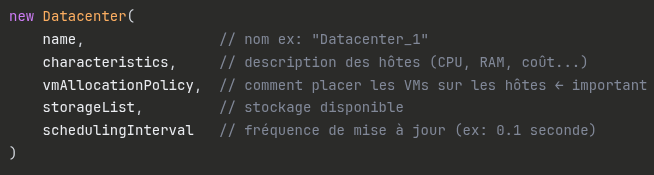

Le datacenter ne contient pas directement les hôtes. Il les contient via `DatacenterCharacteristics`. C'est un niveau d'indirection à retenir.

### Focus
`vmAllocationPolicy` : Décide de comment les VMs sont réparties sur les hôtes, ce qui impacte directement la __charge CPU__ et donc __l'énergie__.

### Remarque :

__Datacenter.java__  ne mesure pas l'énergie.
Pour le projet on utilisera sa classe fille : `PowerDatacenter.java` qui mesure l'énergie


## 3. Powerdatcenter.java

C'est __Datacenter.java + la mesure d'énergie__. C'est cette classe qu'on utiliseras dans tous les scénarios.

### Parametres

```
new PowerDatacenter(
    name,
    characteristics,
    vmAllocationPolicy,    // impact sur l'énergie
    storageList,
    schedulingInterval     // plus il est petit, plus la mesure est précise
)
```

### Metrique Energie 

```
powerDatacenter.getPower()  // énergie totale consommée en Watt·seconde
```

#### Autres :
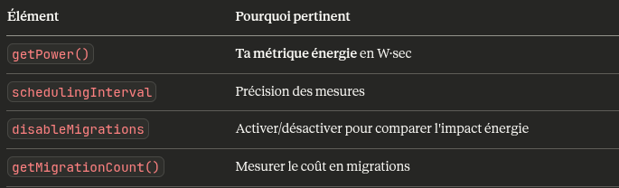


## 4. host.java

Un serveur physique dans le datacenter. C'est lui qui héberge les VMs, et c'est __sa charge CPU qui détermine l'énergie consommée__.

### Parametres

```
new Host(
    id,
    ramProvisioner,   // gestion de la RAM  ex: new RamProvisionerSimple(ram)
    bwProvisioner,    // gestion bande passante ex: new BwProvisionerSimple(bw)
    storage,          // stockage en MB
    peList,           // liste des cœurs CPU ← impact direct sur performance
    vmScheduler       // comment les VMs se partagent les cœurs
)
```

#### Param. impactant Energie et Performance

__PE__ = Un cœur physique avec une capacité en MIPS

```
List<Pe> peList = new ArrayList<>();

peList.add(new Pe(0, new PeProvisionerSimple(1000))); // 1 cœur à 1000 MIPS
peList.add(new Pe(1, new PeProvisionerSimple(1000))); // 2 cœurs au total
```

__VmScheduler__ = Partage des cœurs entre VMs

```
new VmSchedulerTimeShared(peList)   // les VMs partagent les cœurs
new VmSchedulerSpaceShared(peList)  // chaque VM a ses cœurs dédiés
```

### Methodes Utiles 

```
host.getTotalMips()              // capacité totale du serveur
host.getAvailableMips()          // MIPS encore disponibles
host.getNumberOfFreePes()        // cœurs libres
host.getGuestList()              // liste des VMs hébergées
```

#### Remarques : 

`Host.java` seul ne mesure pas l'énergie. Il faut sa classe fille : `PowerHost` contient le PowerModel (consommation physique du serveur).


## 5. PowerHost.java 

C'est __Host.java + un modèle de consommation électrique__. C'est la classe la plus importante pour mesurer l'énergie par serveur.

### Creation : un seul paramètre en plus par rapport à Host

```
new PowerHost(
    id,
    ramProvisioner,
    bwProvisioner,
    storage,
    peList,
    vmScheduler,
    powerModel         // ← LE paramètre clé : modèle de consommation électrique
)
```

#### Le PowerModel : pièce centrale pour l'énergie

C'est lui qui définit __combien de Watts consomme le serveur selon sa charge CPU__.

CloudSim fournit plusieurs modèles prêts à l'emploi dans power/models/ :


### Methodes utiles

```
// Consommation instantanée en Watts selon la charge actuelle
host.getPower()

// Consommation pour une charge donnée (entre 0 et 1)
host.getPower(0.75)  // consommation à 75% de charge CPU

// Historique de charge CPU ← utile pour tracer des courbes
host.getUtilizationHistory()

// Charge CPU actuelle (héritée de HostDynamicWorkload)
host.getUtilizationOfCpu()
```

### Quelques modeles de consommation...

Tous les modèls répondent à la même question :__"Si mon serveur est chargé à X%, combien de Watts consomme-t-il ?"__

#### Formule generale 

`Consommation = idle + (maxPower - idle) × f(utilisation)`

Ce qui change entre les modèles, c'est la fonction f() : la forme de la courbe.

#### Paremetres Communs

```
new PowerModelLinear(maxPower, staticPowerPercent)
// maxPower        = consommation à 100% de charge (ex: 200W)
// staticPowerPercent = % consommé à vide (ex: 0.5 = 50% → 100W idle)
```

#### Les 4 philosophies

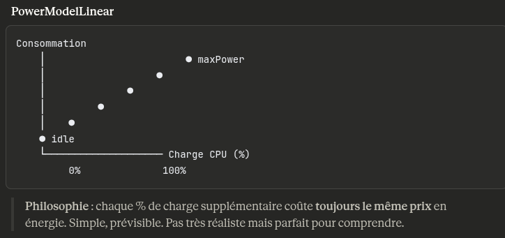

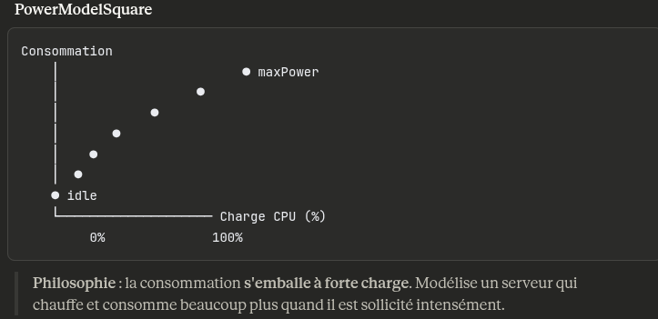

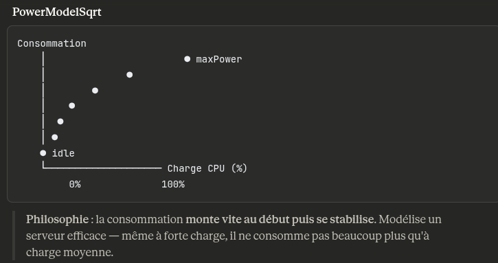

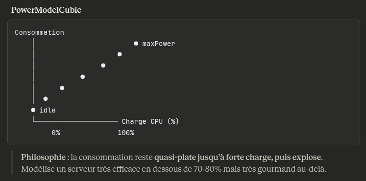


## 6. Vm.java 

Une machine virtuelle qui tourne sur un hôte physique. Elle __reçoit les Cloudlets et les exécute selon une politique d'ordonnancement__.

### Création :

```
new Vm(
    id,                  // identifiant unique
    userId,              // id du broker propriétaire
    mips,                // puissance de calcul par cœur ← impact direct temps d'exécution
    numberOfPes,         // nb de cœurs ← impact charge CPU → énergie
    ram,                 // RAM en MB
    bw,                  // bande passante
    size,                // taille image disque en MB
    vmm,                 // "Xen" par convention
    cloudletScheduler    // ← politique d'ordonnancement des tâches
)
```

#### Focus 

```
mips,                // puissance de calcul par cœur ← impact direct temps d'exécution__

numberOfPes,         // nb de cœurs ← impact charge CPU → énergie__

cloudletScheduler    // ← politique d'ordonnancement des tâches__
```

__Temps d'exécution = cloudletLength / mips__

#### CloudletScheduler : paramètre crucial

C'est lui qui définit __comment la VM gère plusieurs Cloudlets en même temps__ :

```
new CloudletSchedulerTimeShared()
// Tous les Cloudlets s'exécutent en parallèle
// Chacun reçoit une fraction du MIPS → tous finissent plus tard
// Charge CPU élevée en permanence

new CloudletSchedulerSpaceShared()
// Les Cloudlets s'exécutent un par un
// Chacun reçoit 100% du MIPS → file d'attente possible
// Charge CPU plus variable
```

### Methodes utiles

```
1. Charge CPU de la VM à un instant donné (utilisée par PowerHost)

vm.getTotalUtilizationOfCpu(time)       // entre 0 et 1
vm.getTotalUtilizationOfCpuMips(time)   // en MIPS absolus

2. Ressources allouées réellement par l'hôte

vm.getCurrentAllocatedMips()            // MIPS effectivement alloués
vm.getCurrentAllocatedRam()             // RAM effectivement allouée

3. État de la VM

vm.isInMigration()                      // ← utile Phase 3 pour suivre les migrations
vm.getMips()                            // puissance configurée
vm.getNumberOfPes()                     // nb de cœurs
```

__c'est la VM qui remonte la charge CPU à l'hôte, qui calcule ensuite l'énergie via le PowerModel.__


## 7. Cloudlet.java

Un Cloudlet = une tâche applicative à exécuter dans le cloud. Dans la vraie vie c'est par exemple : un job de calcul, un traitement de données, une requête web.

__cloudletLength__ représente la quantité de travail d’une tâche en MI (Million Instructions).

1 MI = 1 000 000 instructions à exécuter (C’est la taille de la tâche que la machine virtuelle doit traiter).

__MIPS (Million Instructions Per Second)__

MIPS = puissance de calcul de la machine
(1 MIPS = 1 million d’instructions par seconde)

__Temps d'execution = ( MI / MIPS )__

__Charge Totale = cloudletLength × numberOfPes (MI)__


### UtilizationModel 
C'est ce qui définit comment la tâche consomme les ressources.

#### 3 Types :
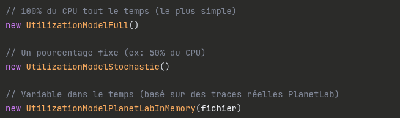

### Paramètres (pour créer un Cloudlet)
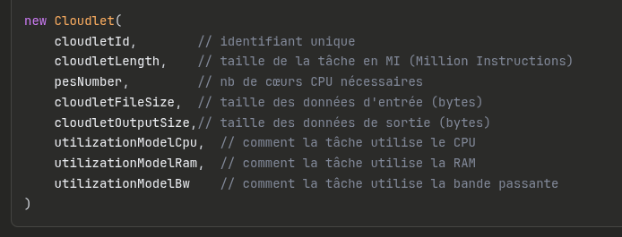

### Métriques
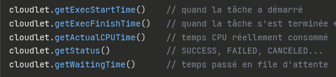

#### Focus
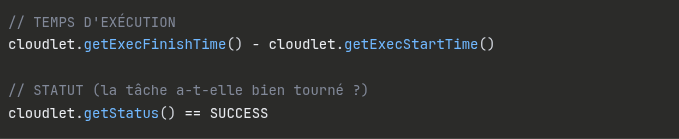
```
cloudlet.getWallClockTime()  ---->  temps total (attente + exécution)
```


## POLITIQUES D'ORDONNANCEMENT 

### Niveau 1 - `VmScheduler` : partage des cœurs physiques entre VMs

__Question : comment un hôte physique partage ses cœurs entre plusieurs VMs ?__

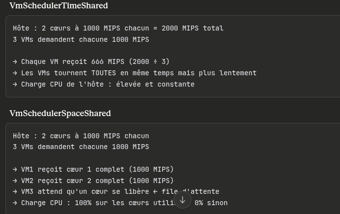


### Niveau 2 - CloudletScheduler : partage des ressources VM entre Cloudlets

__Question : comment une VM partage ses ressources entre plusieurs Cloudlets ?__

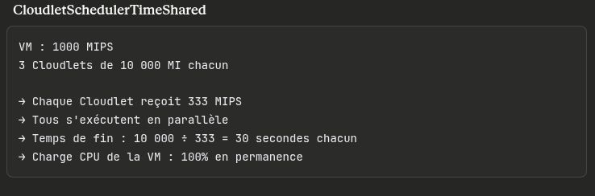

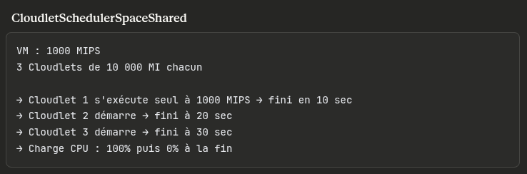

__Makespan__ = temps entre le début du 1er Cloudlet et la fin du dernier :  c'est la métrique de performance globale.


### Remarques :

__Processor Sharing__ = C'est une variante de `TimeShared` mais plus fine.

`TimeShared classique` :
Divise le MIPS également entre tous les Cloudlets

`Processor Sharing` :
- Divise proportionnellement selon la demande de chaque Cloudlet
- Plus équitable, plus proche du comportement réel des OS

__Dans CloudSim c'est CloudletSchedulerDynamicWorkload__