# Rapport de Synthèse : Architecture et Exploration de CloudSim

## Architecture et Concepts Fondamentaux

L'architecture de CloudSim suit un modèle hiérarchique où chaque entité simule un composant réel du Cloud. Le succès de la simulation repose sur l'interaction entre les ressources physiques (Infrastructure) et les besoins logicielles (Workload).

### Les Classes Principales

- **Datacenter** : L'unité de base du fournisseur. Il gère une liste de Hosts. Dans CloudSim 7G, il est responsable de la mesure globale de la consommation énergétique.

- **Host** : Représente le serveur physique. Il possède une capacité CPU (en MIPS), de la RAM et du stockage. Il utilise un VmScheduler pour diviser ses ressources entre les machines virtuelles.

- **VM** (Virtual Machine) : Environnement virtuel où s'exécutent les tâches. Elle possède ses propres caractéristiques (MIPS, RAM) qui sont des sous-ensembles de celles du Host.

- **Cloudlet** : Représente la charge de travail (application). Sa caractéristique principale est sa longueur (nombre d'instructions à exécuter).

<!-- Image placeholder -->

<p align="center">
  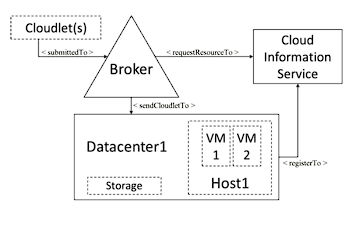
</p>

---

## 2. Modèle d'Exécution et Flux de Contrôle

Le modèle suit une séquence logique déclenchée par des événements discrets :

1. **Le Broker (User)** : Soumet la liste des VMs souhaitées et des Cloudlets au Datacenter.
2. **Allocation de VM** : Le Datacenter vérifie quel Host peut accueillir chaque VM (Politique de placement).
3. **Liaison Cloudlet-VM** : Une fois les VMs créées, le Broker envoie les Cloudlets vers les VMs spécifiques.
4. **Exécution** : La VM traite le Cloudlet en utilisant le temps CPU alloué par le Host.

## 3. Politiques d'Ordonnancement (Default VM Schedulers)

L'arbitrage des ressources se fait à deux niveaux :

| **Politique**        | **Fonctionnement**                                         | **Impact Performance**                                  |
|----------------------|------------------------------------------------------------|---------------------------------------------------------|
| **SpaceShared**      | Un seul Cloudlet occupe un cœur CPU à la fois.            | Débit constant, mais risque de file d'attente.          |
| **TimeShared**       | Plusieurs Cloudlets se partagent le même cœur simultanément. | Risque de dégradation de performance (contexte switching). |
| **Processor Sharing**| Division égale de la puissance CPU entre toutes les tâches actives. | Idéal pour l'analyse théorique de l'équité des ressources. |

<!-- Image placeholder -->
<p align="center">
  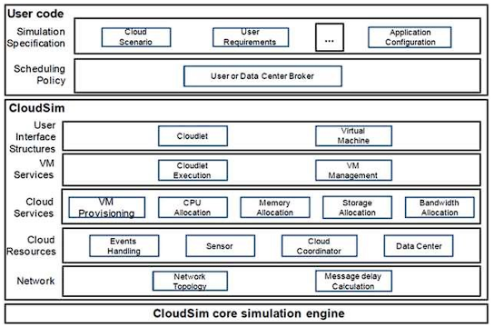
</p>

---

## Identification des paramètres d'entrée configurables

### Comparaison entre les exemples simples de CloudSIM : REDO RECHECK

---

### CloudSimExample1 : Exemple de base « Hello World »

Création d'une infra minimale — 1 hôte, 1 VM et un cloudlet + un Broker
```
mvn clean install
mvn -e exec:java -pl modules/cloudsim-examples/ "-Dexec.mainClass=org.cloudbus.cloudsim.examples.CloudSimExample1"
```


```
Datacenter {
    Architecture "x86",
    OS "Linux",
    Hyperviseur "Xen"
}

Hôte {
    1 processeur (PE) d'une puissance de 1000 MIPS,
    2048 Mo de RAM,
    1 000 000 Mo de stockage,
    10000 de bande passante
}

Cloudlet {
    400 000 instructions (MI)
}
```

<!-- Image placeholder -->
<p align="center">
  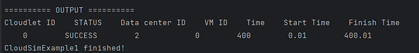
</p>

---

### CloudSimExample2 : Multi-VM et binding manuel

2 cloudlets sur 2 VM différents (un même hôte)

```
mvn clean install
mvn -e exec:java -pl modules/cloudsim-examples/ "-Dexec.mainClass=org.cloudbus.cloudsim.examples.CloudSimExample2"
```

```
Datacenter {
    Architecture "x86",
    OS "Linux",
    Hyperviseur "Xen"
}

Hôte {
    1 processeur de 1000 MIPS,
    2048 Mo de RAM,
    1 000 000 Mo de stockage,
    10000 de bande passante
}

Vm (x2) {
    1 processeur 250 MIPS,
    512 Mo de RAM,
    10000 Mo de taille d'image,
    1000 de bande passante
}

Cloudlet (x2) {
    250 000 instructions (MI)
}
```

<!-- Image placeholder -->
<p align="center">
  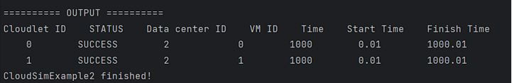
</p>
---

### CloudSimExample3 : Deux cloudlets qui s'exécutent sur une même VM

Les deux cloudlets commencent au même temps t=0, puisqu'ils partagent le CPU ils prennent 2 fois le temps pour finir.

```
mvn clean install
mvn -e exec:java -pl modules/cloudsim-examples/ "-Dexec.mainClass=org.cloudbus.cloudsim.examples.CloudSimExample3"
```

<!-- Image placeholder -->
<p align="center">
  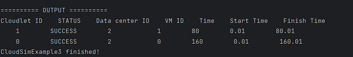
</p>
---

### CloudSimExample4 : Deux Brokers qui gèrent le workload dans un même datacenter

1 hôte / 2 VM un par broker / 2 cloudlets 1 par broker
```
mvn clean install
mvn -e exec:java -pl modules/cloudsim-examples/ "-Dexec.mainClass=org.cloudbus.cloudsim.examples.CloudSimExample4"
```

<!-- Image placeholder -->
<p align="center">
  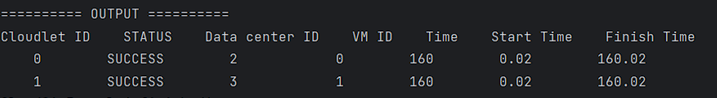
</p>
---

### NetworkExampleTest
```
mvn clean install
mvn -e exec:java -pl modules/cloudsim-examples/ "-Dexec.mainClass=org.cloudbus.cloudsim.examples.network.NetworkExample1"
```


<!-- Image placeholder -->
<p align="center">
  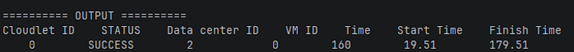
</p>
---

## Étude sur le temps d'exécution

### Variation de la taille de cloudlets

Change the length (in Millions of Instructions or MI) of the Cloudlets. Run the simulation and record the new execution times.

<!-- Image placeholder -->
<p align="center">
  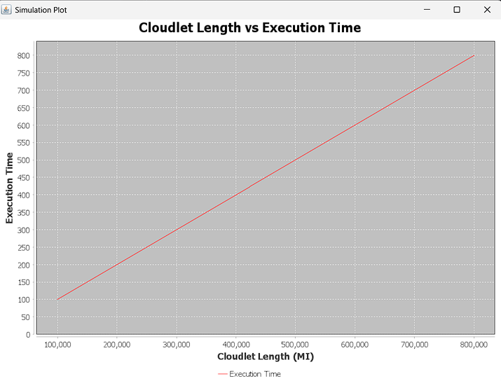
</p>
`100000 MI | 200000 MI | 400000 MI | 800000 MI | 1200000 MI`

---

### Task 7: Vary VM processing power

Change the `mips` (Millions of Instructions Per Second) rating or the number of `pesNumber` (CPUs/Cores) assigned to the VMs.

<!-- Image placeholder -->
<p align="center">
  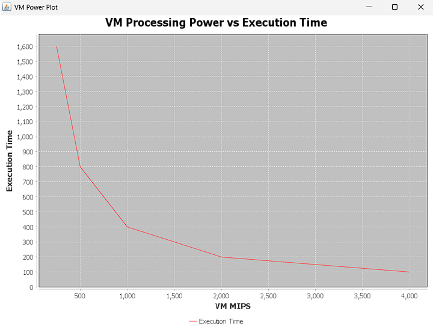
</p>
---

### Impact du nombre de VM sur le Makespan

<!-- Image placeholder -->
<p align="center">
  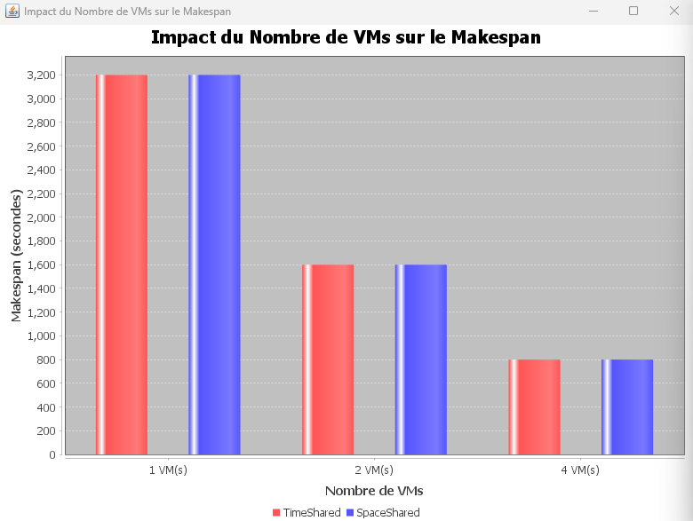
</p>
---

### Impact de la politique sur le temps moyen de complétion

**Le Temps Moyen regarde du point de vue de la tâche (ou de l'utilisateur) :** En moyenne, combien de temps une tâche unique a-t-elle dû attendre dans le système avant d'être livrée ?

<!-- Image placeholder -->
<p align="center">
  
</p>
Le temps moyen d'utilisation CPU est maximal 100%

<!-- Image placeholder -->
<p align="center">
  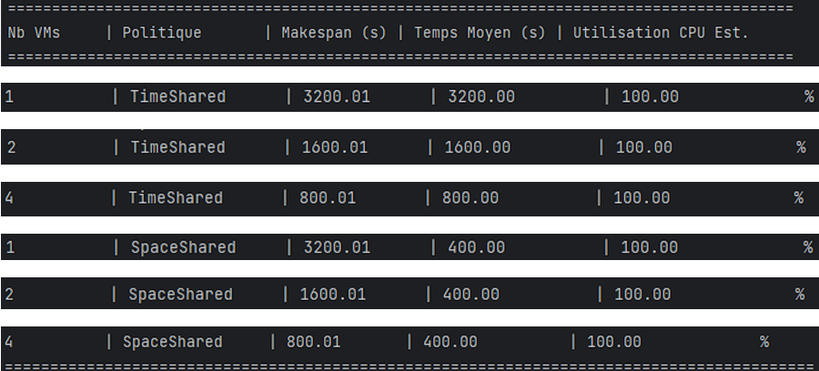
</p>


---

## Modèles de consommation énergétique

- Mesurer l'énergie consommée (kWh) en fonction de la charge CPU
- Activer le modèle de puissance : PowerModel (Linear, Square, Cubic)
- Configurer des hôtes avec des profils de consommation différents

> **Note :** La différence entre les Classes PowerModel est essentielle pour évaluer l'efficacité et la consommation énergétique des serveurs physiques (Hosts) au sein d'un data center.

### PowerModelLinear (Linéaire)

C'est le modèle le plus basique. Il suppose que la consommation d'énergie augmente de manière strictement proportionnelle à la charge du CPU.

<!-- Image placeholder -->
<p align="center">
  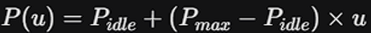
</p>

**Utilisation :** Excellente approximation générale pour les évaluations standards de data centers → une référence de base.

---

### PowerModelSquare (Carré / Quadratique)

Ce modèle suppose que la consommation d'énergie augmente de façon quadratique avec l'utilisation du CPU.

<!-- Image placeholder -->
<p align="center">
  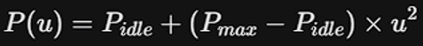
</p>


**Utilisation :** Plus réaliste pour certains processeurs modernes, ce modèle reflète une architecture où le processeur est très économe en énergie à charge partielle.

---

### PowerModelCubic (Cubique)

Ce modèle accentue encore plus l'efficacité à faible charge, avec une consommation qui augmente de façon cubique.

<!-- Image placeholder -->
<p align="center">
  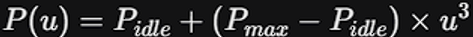
</p>


**Utilisation :** Il est souvent utilisé pour modéliser des processeurs équipés de technologies d'économie d'énergie très agressives, comme le DVFS (Dynamic Voltage and Frequency Scaling).

---
> **Note :** <p align="center">
>  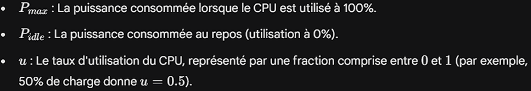
></p>


<p align="center">
>  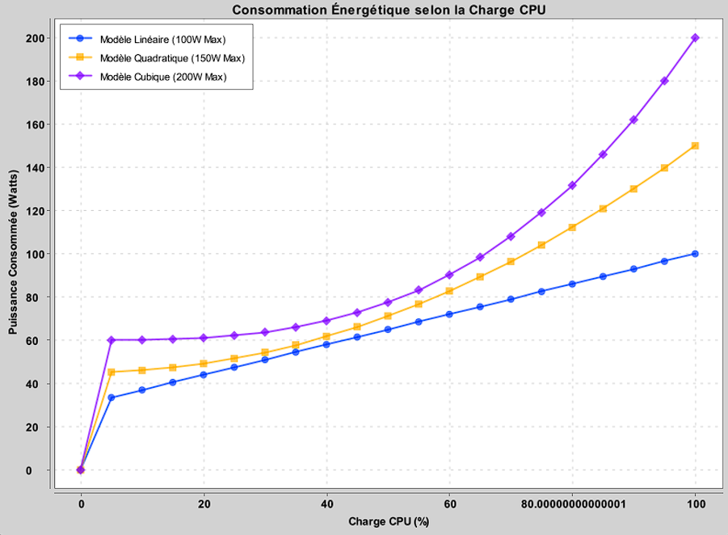
></p>

À travers la simulation, nous observons que si le modèle **linéaire** offre une croissance prévisible de la consommation, les modèles **quadratique** et **cubique** révèlent une inefficacité énergétique croissante à haute charge, où la puissance consommée (Watts) augmente de façon **exponentielle** par rapport au gain de performance.

<p align="center">
>  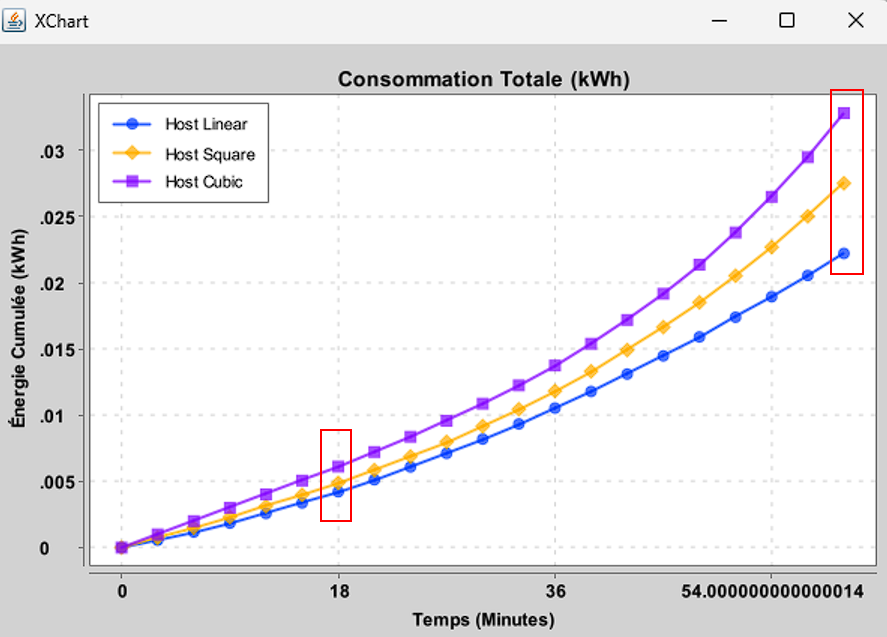
></p>
Ce graphique illustre l'évolution de l'énergie cumulée en **kWh** au cours du temps. Il démontre que les inefficacités du modèle cubique ne sont pas seulement instantanées, mais qu'elles s'accumulent de manière exponentielle. À la fin de la période de 60 minutes, l'hôte utilisant le modèle cubique présente une consommation totale nettement supérieure aux modèles linéaire et quadratique, illustrant le surcoût énergétique lié à l'utilisation de serveurs haute performance sous forte charge sur de longues périodes.

---

## DVFS
Le DVFS (Dynamic Voltage and Frequency Scaling) est une technique de gestion de l'énergie au niveau matériel. Elle ajuste dynamiquement la tension et la fréquence de fonctionnement d'un processeur en fonction de son utilisation actuelle. Abaisser la fréquence pendant les périodes de faible charge de travail réduit la consommation d'énergie, tandis que l'augmenter pendant les pics de demande garantit que les applications répondent à leurs exigences de performance.
<p align="center">
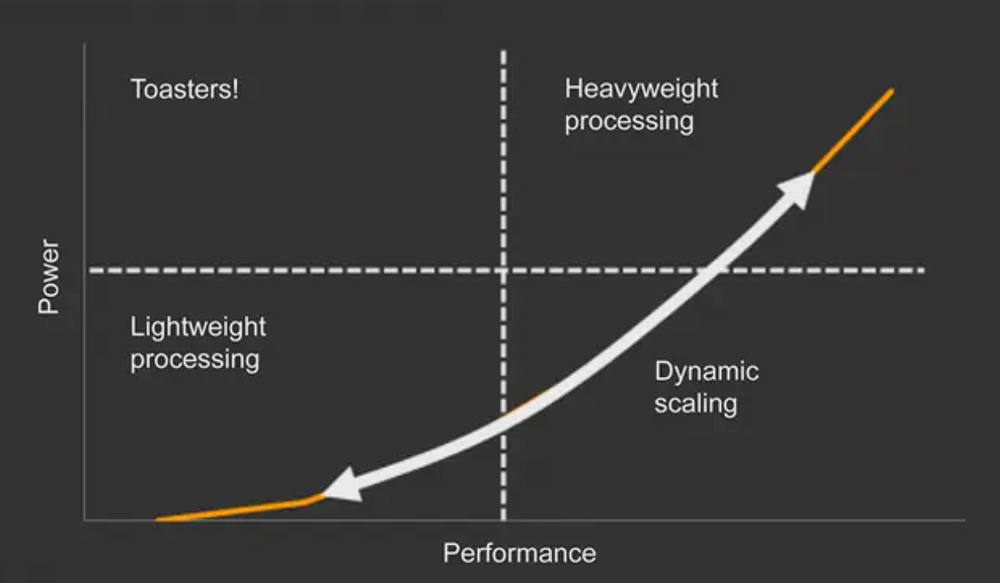xx
</p>
---

## VM Placement Policies

<!-- Image placeholder -->

---

## VM Migration

<!-- Image placeholder -->