# Rapport de Synthèse : Architecture et Exploration de CloudSim

## Architecture et Concepts Fondamentaux

L'architecture de CloudSim suit un modèle hiérarchique où chaque entité simule un composant réel du Cloud. Le succès de la simulation repose sur l'interaction entre les ressources physiques (Infrastructure) et les besoins logicielles (Workload).

### Les Classes Principales

- **Datacenter** : L'unité de base du fournisseur. Il gère une liste de Hosts. Dans CloudSim 7G, il est responsable de la mesure globale de la consommation énergétique.

- **Host** : Représente le serveur physique. Il possède une capacité CPU (en MIPS), de la RAM et du stockage. Il utilise un VmScheduler pour diviser ses ressources entre les machines virtuelles.

- **VM** (Virtual Machine) : Environnement virtuel où s'exécutent les tâches. Elle possède ses propres caractéristiques (MIPS, RAM) qui sont des sous-ensembles de celles du Host.

- **Cloudlet** : Représente la charge de travail (application). Sa caractéristique principale est sa longueur (nombre d'instructions à exécuter).

<!-- Image placeholder -->

<p align="center">
  
</p>

---

## 2. Modèle d'Exécution et Flux de Contrôle

Le modèle suit une séquence logique déclenchée par des événements discrets :

1. **Le Broker (User)** : Soumet la liste des VMs souhaitées et des Cloudlets au Datacenter.
2. **Allocation de VM** : Le Datacenter vérifie quel Host peut accueillir chaque VM (Politique de placement).
3. **Liaison Cloudlet-VM** : Une fois les VMs créées, le Broker envoie les Cloudlets vers les VMs spécifiques.
4. **Exécution** : La VM traite le Cloudlet en utilisant le temps CPU alloué par le Host.

## 3. Politiques d'Ordonnancement (Default VM Schedulers)

L'arbitrage des ressources se fait à deux niveaux :

| **Politique**        | **Fonctionnement**                                         | **Impact Performance**                                  |
|----------------------|------------------------------------------------------------|---------------------------------------------------------|
| **SpaceShared**      | Un seul Cloudlet occupe un cœur CPU à la fois.            | Débit constant, mais risque de file d'attente.          |
| **TimeShared**       | Plusieurs Cloudlets se partagent le même cœur simultanément. | Risque de dégradation de performance (contexte switching). |

<!-- Image placeholder -->
<p align="center">
  
</p>

---

## Identification des paramètres d'entrée configurables

### Comparaison entre les exemples simples de CloudSIM : REDO RECHECK

---

### CloudSimExample1 : Exemple de base « Hello World »

Création d'une infra minimale — 1 hôte, 1 VM et un cloudlet + un Broker
```
mvn clean install
mvn -e exec:java -pl modules/cloudsim-examples/ "-Dexec.mainClass=org.cloudbus.cloudsim.examples.CloudSimExample1"
```


```
Datacenter {
    Architecture "x86",
    OS "Linux",
    Hyperviseur "Xen"
}

Hôte {
    1 processeur (PE) d'une puissance de 1000 MIPS,
    2048 Mo de RAM,
    1 000 000 Mo de stockage,
    10000 de bande passante
}

Cloudlet {
    400 000 instructions (MI)
}
```

<!-- Image placeholder -->
<p align="center">
  
</p>

---

### CloudSimExample2 : Multi-VM et binding manuel

2 cloudlets sur 2 VM différents (un même hôte)

```
mvn clean install
mvn -e exec:java -pl modules/cloudsim-examples/ "-Dexec.mainClass=org.cloudbus.cloudsim.examples.CloudSimExample2"
```

```
Datacenter {
    Architecture "x86",
    OS "Linux",
    Hyperviseur "Xen"
}

Hôte {
    1 processeur de 1000 MIPS,
    2048 Mo de RAM,
    1 000 000 Mo de stockage,
    10000 de bande passante
}

Vm (x2) {
    1 processeur 250 MIPS,
    512 Mo de RAM,
    10000 Mo de taille d'image,
    1000 de bande passante
}

Cloudlet (x2) {
    250 000 instructions (MI)
}
```

<!-- Image placeholder -->
<p align="center">
  
</p>
---

### CloudSimExample3 : Deux cloudlets qui s'exécutent sur une même VM

Les deux cloudlets commencent au même temps t=0, puisqu'ils partagent le CPU ils prennent 2 fois le temps pour finir.

```
mvn clean install
mvn -e exec:java -pl modules/cloudsim-examples/ "-Dexec.mainClass=org.cloudbus.cloudsim.examples.CloudSimExample3"
```

<!-- Image placeholder -->
<p align="center">
  
</p>
---

### CloudSimExample4 : Deux Brokers qui gèrent le workload dans un même datacenter

1 hôte / 2 VM un par broker / 2 cloudlets 1 par broker
```
mvn clean install
mvn -e exec:java -pl modules/cloudsim-examples/ "-Dexec.mainClass=org.cloudbus.cloudsim.examples.CloudSimExample4"
```

<!-- Image placeholder -->
<p align="center">
  
</p>
---

### NetworkExampleTest
```
mvn clean install
mvn -e exec:java -pl modules/cloudsim-examples/ "-Dexec.mainClass=org.cloudbus.cloudsim.examples.network.NetworkExample1"
```


<!-- Image placeholder -->
<p align="center">
  
</p>
---

## Étude sur le temps d'exécution

### 1. Variation de la taille de cloudlets

Change the length (in Millions of Instructions or MI) of the Cloudlets. Run the simulation and record the new execution times.
```
Le but est de démontrer comment la taille d'une tâche (Cloudlet Length) influence directement son temps d'exécution dans un environnement Cloud.
```
5 scénarios différents. À chaque itération, on augmente la longueur du Cloudlet (de 100 000 à 800  000 MI - Millions d'Instructions) tout en gardant la puissance de la machine virtuelle (VM) constante.
```
mvn clean install
mvn -e exec:java -pl modules/cloudsim-examples/ "-Dexec.mainClass=org.cloudbus.cloudsim.examples.custom.CC0_CloudletSize"
```
```
Datacenter (x1)
{
Architecture : x86, OS : Linux, VMM : Xen
Coûts : 3.0 (CPU), 0.05 (RAM), 0.001 (Stockage).
Nombre : 1 instance créée à chaque itération.
}


Host (x1 par Datacenter)
{
Processeur (PE) : 1 CPU de 1000 MIPS.
RAM : 2048 Mo.
Stockage : 1 000 000 Mo.
Bande passante : 10 000.
Politique : VmSchedulerTimeShared (Partage de temps entre VMs).
}


VM (x1 par simulation)
{
Puissance : 1000 MIPS (1 CPU virtuel).
RAM : 512 Mo.
Taille Image : 10 000 Mo.
Bande passante : 1000.
Ordonnanceur : CloudletSchedulerTimeShared.
}


Cloudlet (x1 par simulation)
{
Nombre de tests : 5 itérations avec des tailles différentes.
Longueurs (MI) : 100 000, 200 000, 400 000, 600 000, 800 000.
Fichiers : 300 (Input/Output).
Utilisation : UtilizationModelFull (100% des ressources VM consommées).
}

```

<!-- Image placeholder -->
<p align="center">
  
</p>
`100000 MI | 200000 MI | 400000 MI | 800000 MI | 1200000 MI`

---

### 2. Impact de la puissance CPU sur le temps d'éxecution.
L'objectif est de démontrer l'impact de la puissance CPU (exprimée en MIPS) sur le temps de traitement d'une tâche fixe.
<br>
On fixe la taille du Cloudlet à 400 000 MI et fait varier la capacité de la VM de 250 à 4000 MIPS.

```
mvn clean install
mvn -e exec:java -pl modules/cloudsim-examples/ "-Dexec.mainClass=org.cloudbus.cloudsim.examples.custom.CC2_MIPS_SIZE"
```

<!-- Image placeholder -->
<p align="center">
  
</p>
---

### 3. Impact du nombre de VM sur le Makespan

```
mvn clean install
mvn -e exec:java -pl modules/cloudsim-examples/ "-Dexec.mainClass=org.cloudbus.cloudsim.examples.custom.CC3_Scheduling_VM_SIZE"
```
On compare le temps total d'exécution pour 8 tâches en augmentant le nombre de ressources (1, 2, puis 4 VMs).
### Observation clé : 
Plus tu ajoutes de VMs, plus le Makespan diminue.

- Avec 1 VM, les tâches doivent attendre ou se partager un seul processeur. <br>
- Avec 4 VMs, les tâches sont distribuées, ce qui divise le temps total de traitement par 4 (parallélisme).

<!-- Image placeholder -->
<p align="center">
  
</p>
---

### 4. Impact de la politique sur le temps moyen de complétion


```
mvn clean install
mvn -e exec:java -pl modules/cloudsim-examples/ "-Dexec.mainClass=org.cloudbus.cloudsim.examples.custom.CC3_Scheduling_VM_SIZE"
```

<!-- Image placeholder -->
<p align="center">
  
</p>

Ici, on ne regarde plus la fin de la simulation, mais le confort de chaque tâche <br>
On compare les deux modes d'ordonnancement pour chaque configuration de VM :

- SpaceShared (Exclusif) : Une tâche prend toute la place. Les autres attendent s'il n'y a plus de VM libre.

- TimeShared (Partagé) : Toutes les tâches avancent en même temps, mais moins vite (elles se partagent les MIPS).

### Observation clé :
En SpaceShared, le temps moyen est impacté par la file d'attente. <br>
En TimeShared, le temps moyen est impacté par la dégradation de la vitesse (puisque le CPU est divisé entre les tâches).


<!-- Image placeholder -->
<p align="center"> 
  
Le temps moyen d'utilisation CPU est maximal 100%
</p>

``` 
Notes : 
Makespan : Le temps total nécessaire pour terminer l'ensemble des tâches.
Temps Moyen : La durée moyenne d'exécution d'une tâche.
```

---

## Modèles de consommation énergétique

- Mesurer l'énergie consommée (kWh) en fonction de la charge CPU
- Activer le modèle de puissance : PowerModel (Linear, Square, Cubic)
- Configurer des hôtes avec des profils de consommation différents

> **Note :** La différence entre les Classes PowerModel est essentielle pour évaluer l'efficacité et la consommation énergétique des serveurs physiques (Hosts) au sein d'un data center.

### PowerModelLinear (Linéaire)

C'est le modèle le plus basique. Il suppose que la consommation d'énergie augmente de manière strictement proportionnelle à la charge du CPU.

<!-- Image placeholder -->
<p align="center">
  
</p>

**Utilisation :** Excellente approximation générale pour les évaluations standards de data centers → une référence de base.

---

### PowerModelSquare (Carré / Quadratique)

Ce modèle suppose que la consommation d'énergie augmente de façon quadratique avec l'utilisation du CPU.

<!-- Image placeholder -->
<p align="center">
  
</p>


**Utilisation :** Plus réaliste pour certains processeurs modernes, ce modèle reflète une architecture où le processeur est très économe en énergie à charge partielle.

---

### PowerModelCubic (Cubique)

Ce modèle accentue encore plus l'efficacité à faible charge, avec une consommation qui augmente de façon cubique.

<p align="center">
  
</p>


**Utilisation :** 

Il est souvent utilisé pour modéliser des processeurs équipés de technologies d'économie d'énergie très agressives, comme le DVFS (Dynamic Voltage and Frequency Scaling).

------------

**Note :** <p align="center">


<p align="center">
>  
></p>

À travers la simulation, nous observons que si le modèle **linéaire** offre une croissance prévisible de la consommation, les modèles **quadratique** et **cubique** révèlent une inefficacité énergétique croissante à haute charge, où la puissance consommée (Watts) augmente de façon **exponentielle** par rapport au gain de performance.

<p align="center">
>  
></p>
Ce graphique illustre l'évolution de l'énergie cumulée en **kWh** au cours du temps. Il démontre que les inefficacités du modèle cubique ne sont pas seulement instantanées, mais qu'elles s'accumulent de manière exponentielle. À la fin de la période de 60 minutes, l'hôte utilisant le modèle cubique présente une consommation totale nettement supérieure aux modèles linéaire et quadratique, illustrant le surcoût énergétique lié à l'utilisation de serveurs haute performance sous forte charge sur de longues périodes.

---

## DVFS
Le DVFS (Dynamic Voltage and Frequency Scaling) est une technique de gestion de l'énergie au niveau matériel. Elle ajuste dynamiquement la tension et la fréquence de fonctionnement d'un processeur en fonction de son utilisation actuelle. Abaisser la fréquence pendant les périodes de faible charge de travail réduit la consommation d'énergie, tandis que l'augmenter pendant les pics de demande garantit que les applications répondent à leurs exigences de performance.
<p align="center">

</p>

## Politique de gestion dynamique des ressources 
#### Tâche 1.1 (Conception de scénarios de charge)

Dans CloudSim, la charge de travail d'une application 
(représentée par un Cloudlet) est définie par l'interface UtilizationModel. Vous devez définir trois modèles pour chaque Cloudlet : un pour le CPU, un pour la RAM, et un pour la bande passante. Pour les simulations axées sur l'énergie, c'est l'utilisation du CPU qui est cruciale, car elle détermine la consommation électrique de l'hôte et déclenche les migrations.

<br>
CloudSim possède déjà des modèles basiques (UtilizationModelFull pour 100% et UtilizationModelNull pour 0%)

#### 1. Scénario Statique (Charge constante)
pour fixer une charge spécifique (par exemple 70%), vous devez créer une classe dédiée.

```
public UtilizationModelStatic(double niveauUtilisation) {
        this.niveauUtilisation = niveauUtilisation;  // niveau d'utilization stable exemple : pour UtilizationFull = 100 , Pour UtilizationNull = 0
    }
```

#### 2. Scénario Cyclique (Cycle Jour/Nuit)
Pour simuler une charge qui augmente et diminue de manière fluide au fil du temps, la méthode la plus efficace est d'utiliser une fonction mathématique sinusoïdale (Math.sin).

```
public UtilizationModelCyclic(double min, double max, double periode) {
        this.minUtilisation = min; // niveau minimum d'utilisation 
        this.maxUtilisation = max; // niveau max d'utilisation == peak 
        this.periode = periode; // periode 
    }
```

#### 3. Scénario Burst (Pics de charge soudains)
Ce modèle simule une application qui fonctionne normalement à faible régime, mais qui subit de temps en temps des pics d'activité massifs et soudains.

```
/**
     * @param base Charge CPU normale et basse (ex: 0.20)
     * @param pic La charge CPU pendant le pic (ex: 1.00 pour 100%)
     * @param intervalle Le temps écoulé entre le début de chaque pic
     * @param duree Combien de temps dure le pic d'activité
     */
    public UtilizationModelBurst(double base, double pic, double intervalle, double duree) {
        this.chargeDeBase = base;
        this.chargeEnPic = pic;
        this.intervallePic = intervalle;
        this.dureePic = duree;
    }
```

#### Configuration du Modele de Charge 

```
// ÉTAPE 1 : Choisir et configurer le modèle CPU que vous voulez tester
// Exemple ici avec le modèle Cyclique (20% min, 90% max, un cycle tous les 100 ticks de temps)
UtilizationModel cpuModel = new UtilizationModelCyclic(0.20, 0.90, 100); 

// ÉTAPE 2 : Configurer la RAM et la Bande Passante (généralement on les laisse à 100% pour simplifier)
UtilizationModel ramModel = new UtilizationModelFull(); 
UtilizationModel bwModel = new UtilizationModelFull();

// ÉTAPE 3 : Créer le Cloudlet en lui passant vos modèles
Cloudlet cloudlet = new Cloudlet(
    idCloudlet, 
    longueurCloudlet, 
    nombreCores,     
    tailleFichier, 
    tailleSortie, 
    cpuModel,         // <-- Le modéle configuré déja 
    ramModel, 
    bwModel
);

// ÉTAPE 4 : Ensuite, on ajoute ce cloudlet à la liste de Broker. -> Scénario Normale
```
Lancer la simulation des charges avec cette commande : 
```
mvn -e exec:java -pl modules/cloudsim-examples/ "-Dexec.mainClass=org.cloudbus.cloudsim.examples.custom.UtilizationModels.TestScenariosCharge"
```


<p align="center">
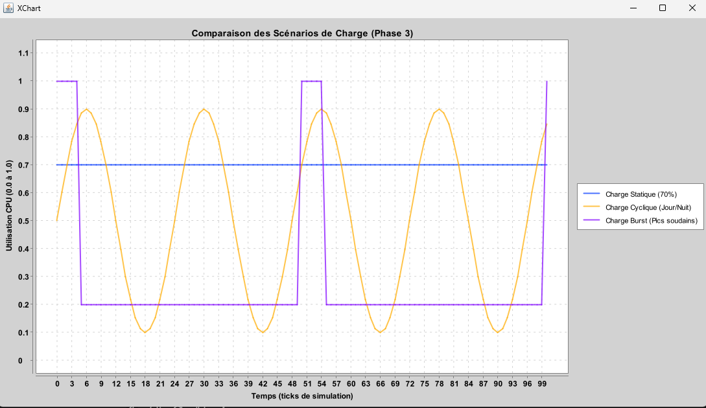Modeles de puissance pour mesurer le DVFS
</p>


Pour bien comprendre le comportement du DVFS on va utiliser une simple topologie pour tester les differents simulateur PowerModel (Full,Static,Cubic,Burst)


### Charge 1 : UtilizationModelFull()

```
mvn -e exec:java -pl modules/cloudsim-examples/ "-Dexec.mainClass=org.cloudbus.cloudsim.examples.custom.Dvfs.Dvfs_UtilizationModelFull"
```
en output , on peut voir : 
<p align="center">
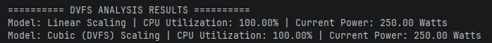
</p>
Comportement normal , puisque le modele de charge CPU est en Full() donc DVFS n'intervient pas 

### Charge 2 : UtilizationModelStatic(50%)

```
mvn -e exec:java -pl modules/cloudsim-examples/ "-Dexec.mainClass=org.cloudbus.cloudsim.examples.custom.Dvfs.Dvfs_UtilizationModelStatic"
```
en output , on peut voir :
<p align="center">
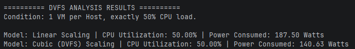
</p>

avec une charge CPU assez faible , on remarque que la consommation d'energie est tombée de 250 watts pour les deux modeles Cubique / Lineare a 187 watt et 140 watts

DVFS va donc abaisser la fréquence pendant les périodes de faible charge de travail.
### Charge 3 : UtilizationModelCyclic() entre 10% et 90% pour un T=100
```
mvn -e exec:java -pl modules/cloudsim-examples/ "-Dexec.mainClass=org.cloudbus.cloudsim.examples.custom.Dvfs.Dvfs_UtilizationModelCyclic"
```
<p align="center">
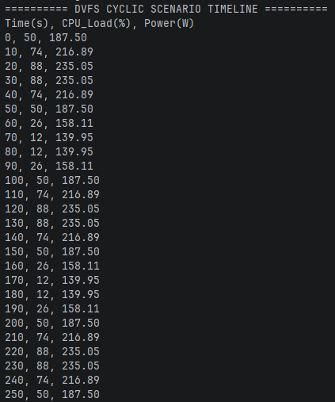
</p>


<p align="center">
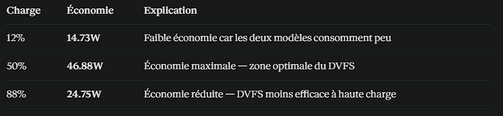
</p>
Note : 

Au pic (100%), l'économie est 0W — les deux modèles atteignent la même puissance maximale. Le DVFS n'apporte un gain que quand la charge est juste en dessous du maximum.

### Charge 4 : UtilizationModelBurst() minimum de 20% et maximum de 100%
```
mvn -e exec:java -pl modules/cloudsim-examples/ "-Dexec.mainClass=org.cloudbus.cloudsim.examples.custom.Dvfs.Dvfs_UtilizationModelBurst"
```
<p align="center">
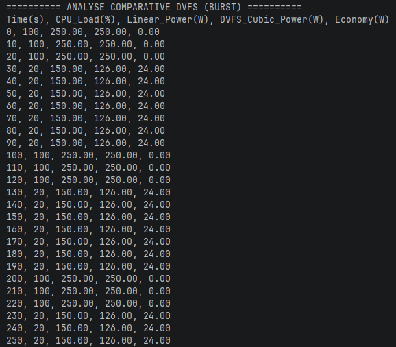
</p>

```
UtilizationModelBurst(0.20, 1.00, 100, 30) → pic de 30s toutes les 100s :

t=0  à t=29  → 100% (pic)      ← burst actif
t=30 à t=99  → 20%  (base)     ← retour au calme == Abaisser la fréquence pendant les périodes de faible charge de travail
t=100 à t=129→ 100% (pic)      ← nouveau burst
t=130 à t=199→ 20%  (base)
...
```

***Conclusion :*** 

Avec ce profil burst, le DVFS économise ~16.8W en continu par serveur — uniquement grâce aux 70% du temps passés en base load.

----------------------

## Placement des VM 

Pour tester le comportement de chaque Politique de placement on prepare la meme infra 
- Un Datacenter composé de 8 Hôtes **NUM_HOSTS=8**.

- Chaque hôte a une capacité fixe de **3000 MIPS** (puissance de calcul) et consomme **200W** au maximum et possède un profil énergétique linéaire.

On défini une liste de 16 VMs **VM_PROFILES=H,M,L** avec des besoins variés en calcul :

- Certaines demandent 1400 MIPS (grosses VMs). x 4

- D'autres demandent 900 MIPS (moyennes). x 6

- D'autres demandent 400 MIPS (petites). x 6

```
Note : Le code utilise Collections.shuffle(list), donc l'ordre dans lequel les VMs arrivent pour être placées change à chaque exécution.
```

<p align="center">
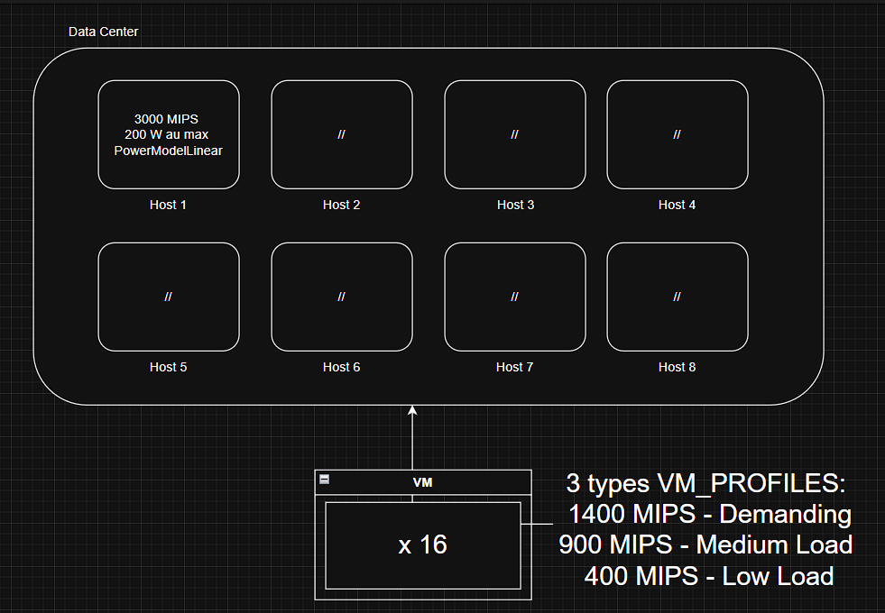
</p>

Creation des VM a partir du **VM_PROFILES**
```
{ MIPS, RAM, BW }
  │      │    └── Bande passante (Mbps)
  │      └─────── Mémoire RAM (MB)
  └────────────── Puissance de calcul (Million Instructions Per Second)
  
  
// VM Lourde   : serveur applicatif, base de données
{1400, 2048, 1000}   // 1400 MIPS, 2 Go RAM, 1000 Mbps

// VM Légère   : microservice, conteneur simple
{ 400,  512,  200}   // 400 MIPS,  512 Mo RAM, 200 Mbps

// VM Moyenne  : serveur web, cache
{ 900, 1024,  500}   // 900 MIPS,  1 Go RAM,  500 Mbps

```


Les 3 algorithmes de Placement :

### FirstFit (Premier Ajustement) :
Place la VM sur le premier hôte disposant de suffisamment de ressources.

```
Politique par défaut proposée par le simulateur
VmAllocationPolicySimple policy = new VmAllocationPolicySimple(hostList)
```
Pour tester : 
```
mvn -e exec:java -pl modules/cloudsim-examples/ "-Dexec.mainClass=org.cloudbus.cloudsim.examples.custom.VM_Placement_Policies.FirstFit" 
```
<p align="center">
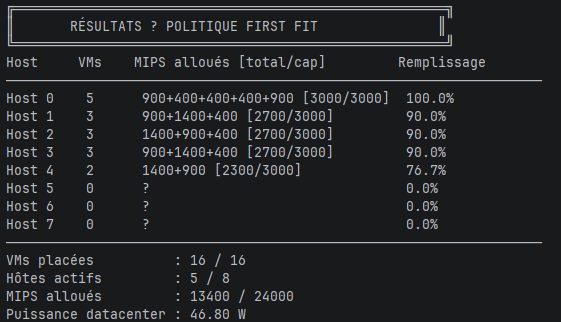
</p>

<p align="center">
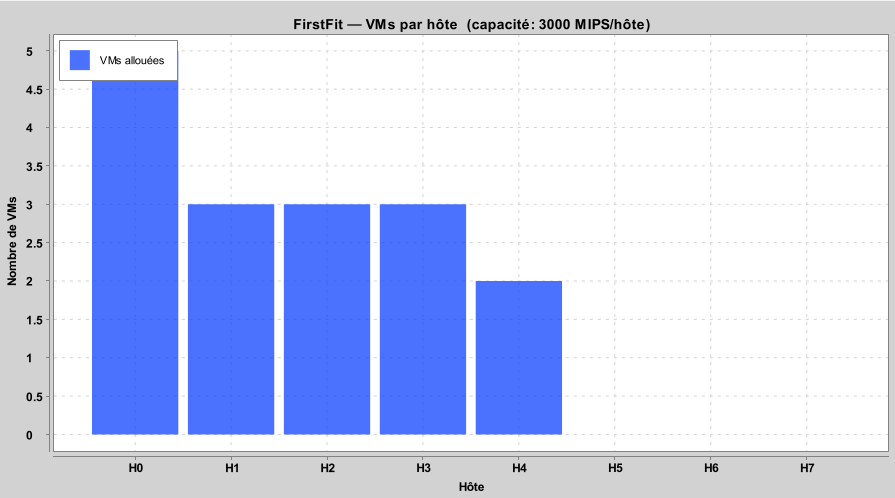
</p>

### BestFit (Meilleur Ajustement) :
Place la VM sur l'hôte qui a le moins de ressources libres tout en pouvant l'accueillir (pour optimiser le remplissage).

La logique est implémentée dans la classe **VmAllocationPolicyBestFit.java** sous Policies

```
@Override
    public HostEntity findHostForGuest(GuestEntity guest) {
        HostEntity bestHost     = null;
        double     minRemaining = Double.MAX_VALUE;

        for (HostEntity host : getHostList()) {
            // Skip hosts that cannot accommodate this guest
            if (!host.isSuitableForGuest(guest)) continue;

            double remaining = host.getTotalMips();

            // Best Fit: choose the host with the smallest remaining capacity
            // that is still large enough to host the VM
            if (remaining < minRemaining) {
                minRemaining = remaining;
                bestHost     = host;
            }
        }

        return bestHost; // null = no suitable host found (CloudSim handles this)
    }
```
Pour tester : 
```
mvn -e exec:java -pl modules/cloudsim-examples/ "-Dexec.mainClass=org.cloudbus.cloudsim.examples.custom.VM_Placement_Policies.BestFit"
```
<p align="center">
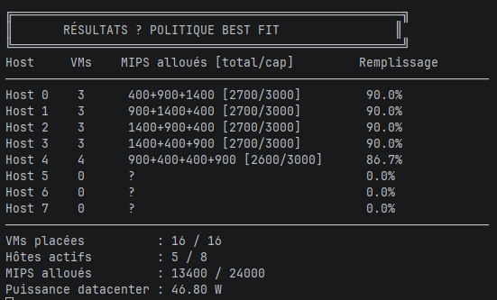
</p>

<p align="center">
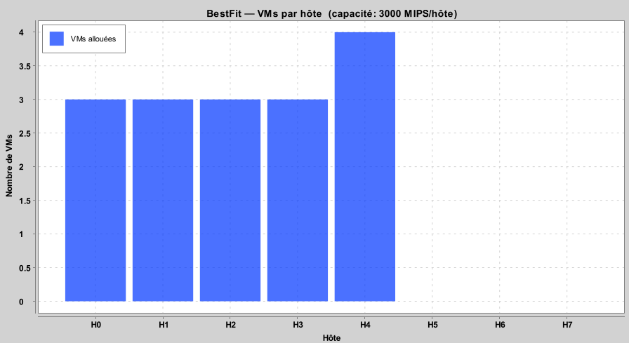
</p>

### Random (Aléatoire) :
Place la VM sur un hôte choisi au hasard parmi ceux qui sont éligibles.

La logique est implémentée dans la classe **VmAllocationPolicyRandomFit.java** sous Policies
```
 // Pick a random host from the list of suitable hosts
        int randomIndex = (int) (Math.random() * suitableHosts.size());
        return suitableHosts.get(randomIndex);
```
Pour tester : 
```
mvn -e exec:java -pl modules/cloudsim-examples/ "-Dexec.mainClass=org.cloudbus.cloudsim.examples.custom.VM_Placement_Policies.RandomFit"
```
<p align="center">
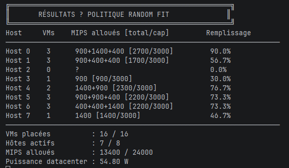
</p>

<p align="center">
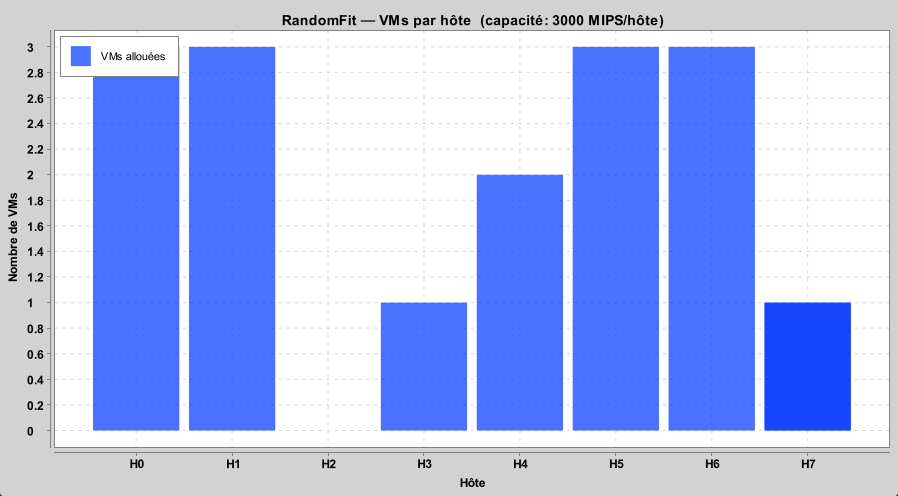
</p>  

### RoundRobin (existe sous CloudSim Plus) :

<p align="center">
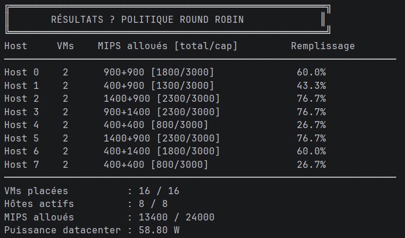
</p>

<p align="center">
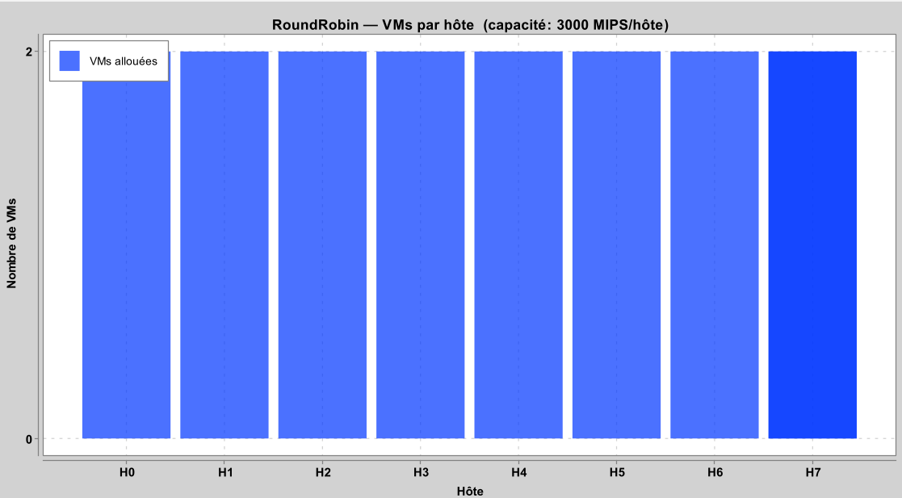
</p>


----------------------
### VM Migration : 

<p align="center">
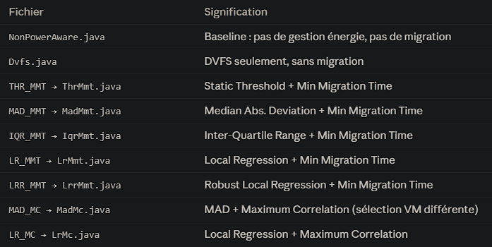
</p>


#### Notes :

String **vmAllocationPolicy** = "Iqr" | "Lrr" | "Mad" | "Thr";


String **vmSelectionPolicy** = "Mc" | "Mmt" | "Mu" | "Rs" ;

----------------------
### Vertical & Horizontal Scaling : 

#### Horizontal Scaling : 
que se passe-t-il si on laisse une seule VM absorber toute la charge, versus si on crée dynamiquement de nouvelles VMs pour la répartir ?
Pour cela on va faire deux test et comparer les Makespan entre un placement Sans HScaling et un autre avec le HScaling

**Architecture :**
Un datacenter contient un seul hôte physique avec 10 000 MIPS, 8 cœurs et 8 Go de RAM. Sur cet hôte, des VMs sont déployées, chacune disposant de 1 000 MIPS, 1 vCPU et 512 Mo de RAM. La charge de travail est constituée de 12 cloudlets, chacun représentant une tâche applicative de 40 000 MI (Million d'Instructions).

<p align="center">
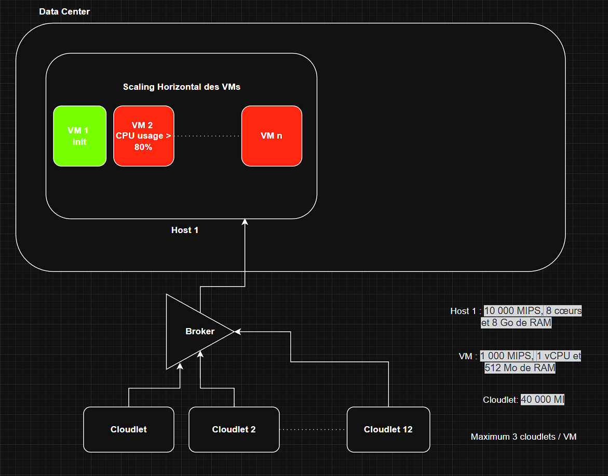
</p>


Pour tester : 
```
mvn -X -e exec:java -pl modules/cloudsim-examples/ "-Dexec.mainClass=org.cloudbus.cloudsim.examples.custom.Scaling.HorizontalScalingExample"
```


**Scénario A — Sans Horizontal Scaling (baseline)**

Les 12 cloudlets sont soumis à une seule VM. Cette VM doit les exécuter séquentiellement avec son scheduleur TimeShared.

**Problème :** 
son CPU devient saturé, le temps d'exécution total (makespan) est maximal, et le temps moyen par cloudlet est élevé.

<p align="center">
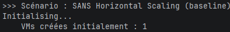
</p>

<p align="center">
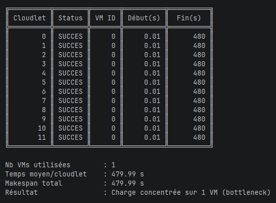
</p>

**Scénario B — Avec Horizontal Scaling**

Un seuil de charge est défini à 80% du CPU et une capacité maximale de 3 cloudlets par VM. Lorsque la simulation détecte que la charge totale dépasse ce seuil sur la VM initiale, elle calcule le nombre de VMs nécessaires :

```
VMs nécessaires = ceil(12 cloudlets / 3 max par VM) = 4 VMs
```

3 nouvelles VMs sont créées dynamiquement par le broker (VM #1, #2, #3) en plus de la VM initiale. Les 12 cloudlets sont ensuite distribués en round-robin : chaque VM reçoit exactement 3 cloudlets et les exécute en parallèle.

```
Hôte physique : un seul Hote H1
│
├── VM #0  ← existante - point de départ
├── VM #1  ← créée dynamiquement par le scaling -> Quand la VM #0 est surchargée (CPU > 80%)
├── VM #2  ← créée dynamiquement par le scaling
└── VM #3  ← créée dynamiquement par le scaling
```

<p align="center">
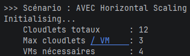
</p>

<p align="center">
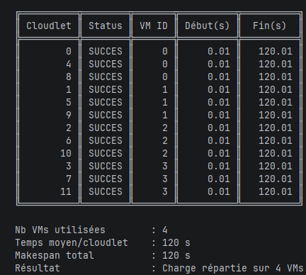
</p>


#### Vertical Scaling : 
augmenter les ressources d’une VM déjà existante comme le CPU (MIPS), le nombre de vCPU et la RAM afin d’améliorer les performances sans créer de nouvelles VMs.


Les différents paramètres de Vertical Scaling dans CloudSim
-  **MIPS** 

```
// Faible puissance → Haute puissance
Vm vmBefore = new Vm(id, brokerId, 500,  1, 512, bw, storage, vmm, scheduler);
Vm vmAfter  = new Vm(id, brokerId, 2000, 1, 512, bw, storage, vmm, scheduler);
//                                 ^^^^
//                            MIPS x4 → cloudlets finissent 4x plus vite
```
- **vCPUs**

```
Vm vmBefore = new Vm(id, brokerId, 500, 1, 512, bw, storage, vmm, scheduler);
Vm vmAfter  = new Vm(id, brokerId, 500, 4, 512, bw, storage, vmm, scheduler);
//                                      ^
//                                 vCPUs x4 → 4 cloudlets en parallèle
```
**Impact direct :** Avec CloudletSchedulerTimeShared, plus de vCPUs = plus de cloudlets exécutés simultanément. Avec CloudletSchedulerSpaceShared, chaque cloudlet occupe un PE entier.


-  **RAM**

```
Vm vmBefore = new Vm(id, brokerId, 500, 1, 512,  bw, storage, vmm, scheduler);
Vm vmAfter  = new Vm(id, brokerId, 500, 1, 2048, bw, storage, vmm, scheduler);
//                                         ^^^^
//                                     RAM x4
```

Pour tester : 

```
mvn -X -e exec:java -pl modules/cloudsim-examples/ "-Dexec.mainClass=org.cloudbus.cloudsim.examples.custom.Scaling.VerticalScalingExample"
```


<p align="center">
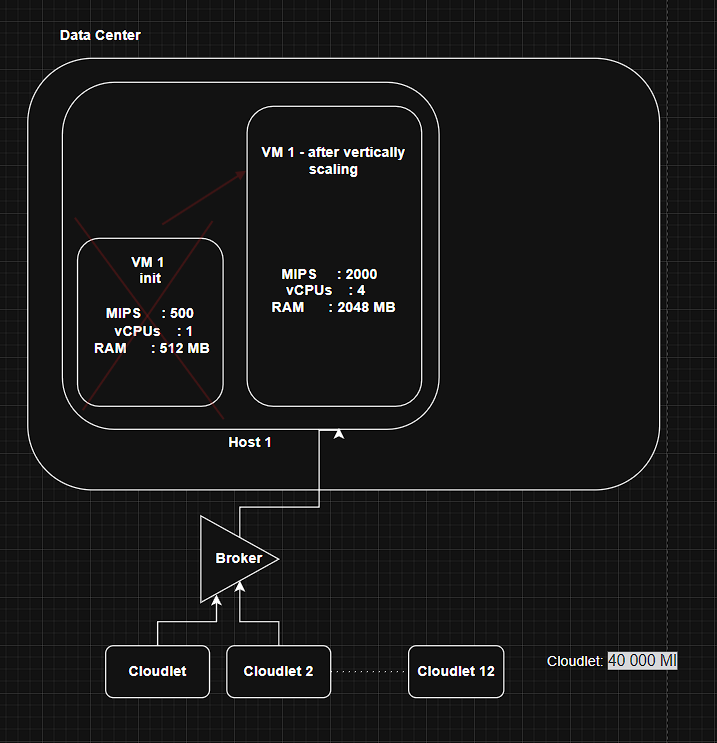
</p>


Résultats : 
<p align="center">
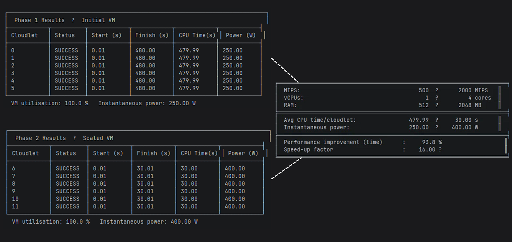
</p>


#### vertical scaling example to check  
#### migration example to check 

